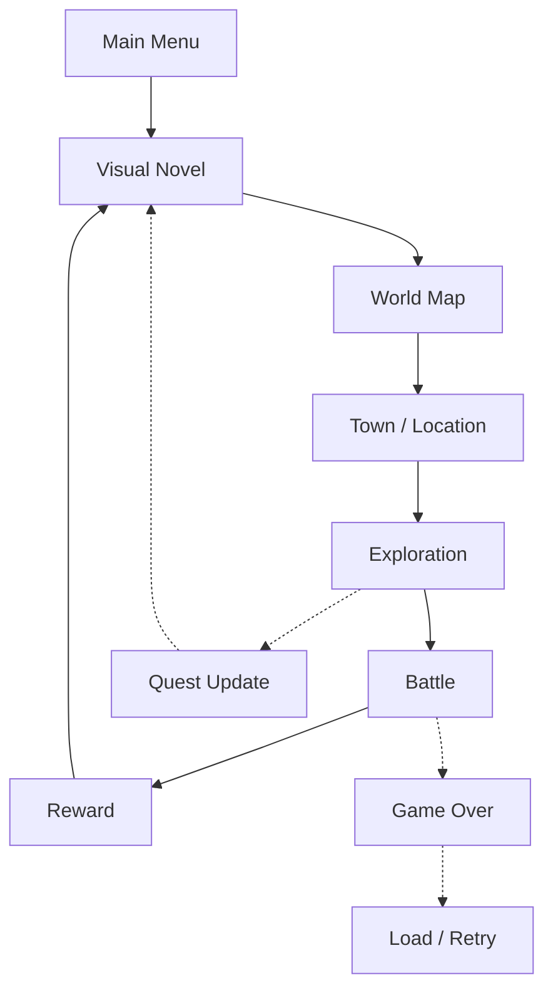
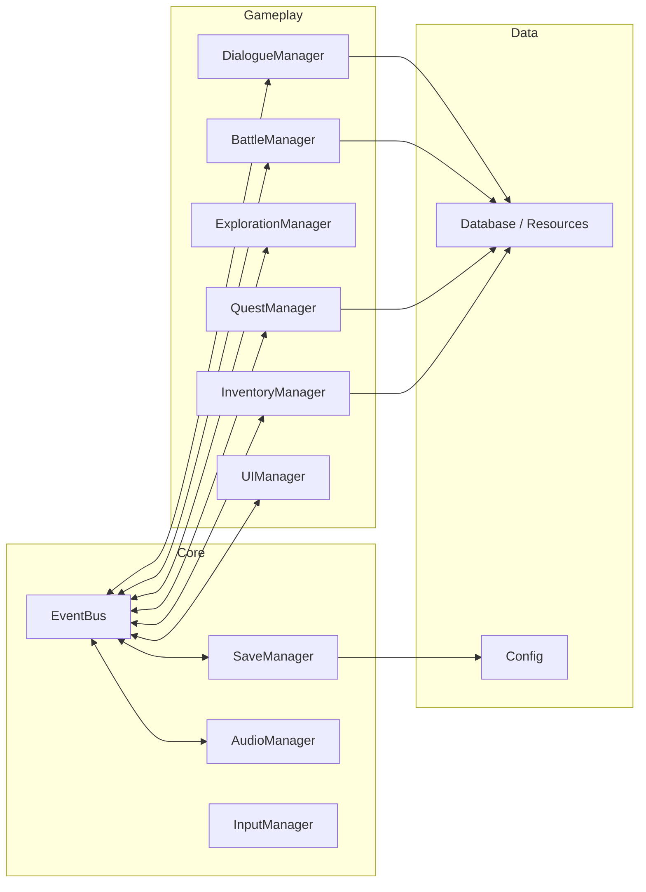
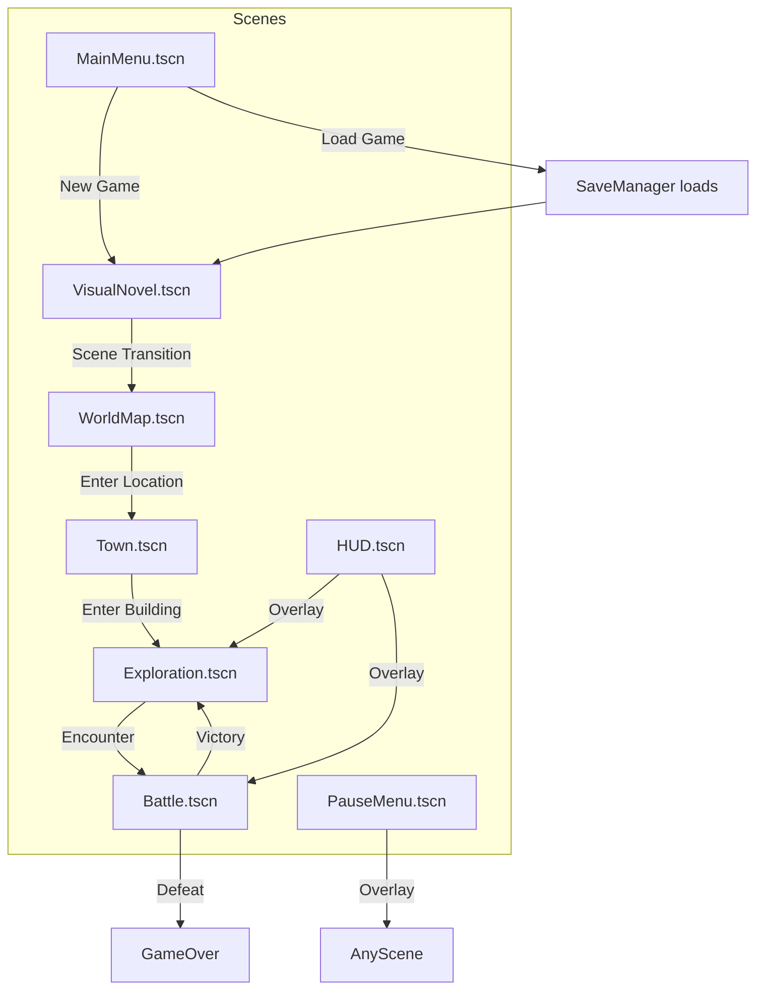
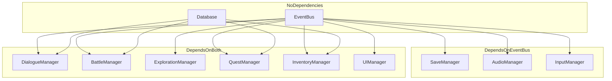

# Architecture

> **Purpose**: Define the high-level system architecture, module responsibilities, and data flow.  
> **Scope**: All gameplay systems and their interactions.  
> **Status**: Draft — to be refined as systems are implemented.

---

## Overview

The game is a **2D RPG + Visual Novel hybrid** composed of independent gameplay modules that communicate through a centralized event bus and shared data stores.

### Gameplay Flow

Each module owns its own data. Cross-module communication uses signals or the event bus — never direct coupling.

---

## Module Architecture

---

## Module Responsibilities

| Module | Type | Responsibility | Owns |
|--------|------|---------------|------|
| **EventBus** | Autoload | Global communication, decoupled dispatch | Signal definitions |
| **Database** | Autoload | Resource loading, caching, content access | Resource cache |
| **SaveManager** | Autoload | Serialization, save files, versioning | Save data, slots |
| **AudioManager** | Autoload | BGM, SFX, bus management, transitions | Audio buses, playlists |
| **InputManager** | Autoload | Input mapping, controller, rebinding, contexts | Input maps, context stack |
| **UIManager** | Autoload | HUD, screen stack, overlays, notifications | UI stack, screen instances |
| **SceneManager** | Autoload | Scene transitions, loading screens, fades | Current scene, transition overlay |
| **DialogueManager** | Scene | VN mode, dialogue loading, branching, choices | Active dialogue state |
| **BattleManager** | Scene | Turn-based combat, enemy AI, damage calc | Battle state, party state |
| **ExplorationManager** | Scene | Player movement, collision, interaction | Player position, active map |
| **QuestManager** | Scene | Quest lifecycle, stage tracking, rewards | Quest progress |
| **InventoryManager** | Scene | Items, equipment, crafting, currency | Item collections |

---

## Data Flow Principles

1. **Data is owned by one module.** No two modules modify the same data directly.
2. **Read access is shared.** Any module can read any data through the Database.
3. **Write access is exclusive.** Only the owning module writes to its data.
4. **State changes are broadcast.** When a module's state changes, it emits a signal or event.
5. **Events never contain game logic.** Events are notifications, not commands.
6. **No direct references between gameplay modules.** Dialogue does not know about Battle. Battle does not know about Inventory.

---

## Scene Flow

---

## Dependency Graph

- **EventBus** and **Database** depend on nothing (zero-dependency core).
- **SaveManager**, **AudioManager**, **InputManager** depend only on EventBus.
- **UIManager** depends on EventBus.
- **SceneManager** depends on EventBus and UIManager (for transitions).
- All gameplay managers depend on EventBus + Database.
- **No circular dependencies** are permitted.

---

## Autoloads vs. Scenes

| Type | Examples | When to Use |
|------|----------|-------------|
| **Autoload (Singleton)** | EventBus, SaveManager, AudioManager | Global systems that exist for the entire lifetime |
| **Loaded Scene** | DialogueBox, HUD, PauseMenu | UI overlays that appear/disappear |
| **Instantiated** | NPC, Enemy, Chest | Reusable objects created as needed |

Autoloads are reserved for systems that:
- Must exist across all scenes.
- Cannot be instantiated more than once.
- Need to be accessible from anywhere.

---

## Future Expansion Considerations

- **New Regions**: Add region data to Database. No architecture changes needed.
- **DLC Content**: Additional resources loaded from DLC paths. Same data model.
- **Localization**: String keys in data, locale-swapping via Database. No code changes.
- **Multiplayer**: EventBus model supports networked event routing. A future NetworkManager would translate events.
- **Modding**: Resource-based data allows mods to replace/extend resource files.

---

## Design Decisions

| Decision | Rationale |
|----------|-----------|
| EventBus over direct references | Decouples modules. New systems can listen without modifying senders. |
| Resource-based data over JSON/CSV | Native Godot format, type-safe, inheritable, hot-reloadable. |
| Singleton managers over scene-based | Managers must exist across all scenes and be globally accessible. |
| Module-owned data | Prevents data corruption. Clear ownership simplifies debugging. |
| No nested dependencies | Avoids circular references. Each module has at most 2 dependencies. |

---

## Related

- [game_design.md](game_design.md) — Game mechanics that drive architecture
- [autoloads.md](autoloads.md) — Singleton definitions
- [managers.md](managers.md) — Manager APIs and contracts
- [event_system.md](event_system.md) — Communication patterns
- [database.md](database.md) — Data architecture
- [decisions.md](decisions.md) — Decision records

