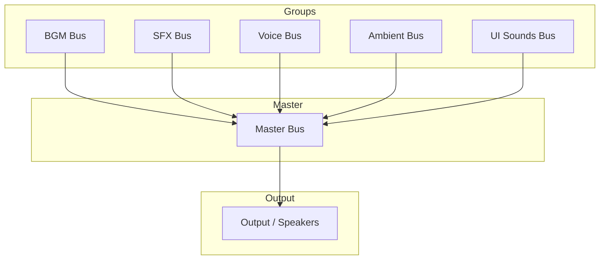

# Audio System

> **Purpose**: Define audio management, BGM transitions, SFX, voice, and bus architecture.  
> **Scope**: AudioManager, audio buses, BGM/SFX resources.  
> **Status**: Draft — to be refined during implementation.

---

## Overview

The audio system manages all game audio: background music, sound effects, ambient sounds, and future voice clips. It supports crossfade transitions, bus volume control, and dynamic audio.

---

## AudioManager API

```gdscript
class_name AudioManager
extends Node

## BGM
func play_bgm(resource: AudioStream, fade_in: float = 1.0) -> void
func stop_bgm(fade_out: float = 1.0) -> void
func crossfade_bgm(resource: AudioStream, duration: float = 2.0) -> void
func get_current_bgm() -> AudioStream
func is_bgm_playing() -> bool

## SFX
func play_sfx(resource: AudioStream, bus: String = "SFX", pitch_variation: float = 0.0) -> void
func play_sfx_at_position(resource: AudioStream, position: Vector2, bus: String = "SFX") -> void

## Voice
func play_voice(resource: AudioStream, character_id: String) -> void
func stop_voice() -> void

## Bus control
func set_bus_volume(bus: String, volume_db: float) -> void
func get_bus_volume(bus: String) -> float
func mute_bus(bus: String) -> void
func unmute_bus(bus: String) -> void
func is_bus_muted(bus: String) -> bool
```

---

## Audio Bus Layout



| Bus | Purpose | Volume Default |
|-----|---------|----------------|
| Master | Overall volume | 0 dB |
| BGM | Background music | 0 dB |
| SFX | Sound effects | -3 dB |
| Voice | Character voice | -2 dB |
| Ambient | Environment sounds | -5 dB |
| UI | UI interaction sounds | -6 dB |

---

## BGM System

### Features

- Crossfade between tracks (configurable duration).
- Per-map BGM defined in MapResource.
- Battle BGM overrides exploration BGM.
- BGM resumes after battle.
- Dynamic layering (add/remove instrument layers).

### BGM Resource

```gdscript
class_name BGMResource
extends Resource

@export var stream: AudioStream
@export var display_name: String
@export var intro_stream: AudioStream     # Optional intro
@export var loop_point: float = 0.0
@export var layers: Array[AudioStream]    # Dynamic layers
```

---

## SFX System

### Features

- One-shot SFX with optional pitch variation.
- Positional audio for 2D world.
- SFX pools for frequently played sounds.
- Category-based volume control.

---

## Audio Settings

Settings are persisted through SaveManager and exposed in the settings menu.

| Setting | Bus | Range |
|---------|-----|-------|
| Master Volume | Master | 0-100% |
| BGM Volume | BGM | 0-100% |
| SFX Volume | SFX | 0-100% |
| Voice Volume | Voice | 0-100% |

---

## Events

| Event | Data | When |
|-------|------|------|
| bgm_started | bgm_id | New BGM begins |
| bgm_stopped | none | BGM stops |
| bgm_changed | from, to | BGM crossfade |
| sfx_played | sfx_id | SFX plays |
| volume_changed | bus, volume | Volume adjusted |

---

## Related

- [architecture.md](architecture.md)
- [autoloads.md](autoloads.md) — AudioManager
- [event_system.md](event_system.md) — Audio events
- [resource_pipeline.md](resource_pipeline.md) — Audio asset pipeline
- [ui_system.md](ui_system.md) — Settings UI
