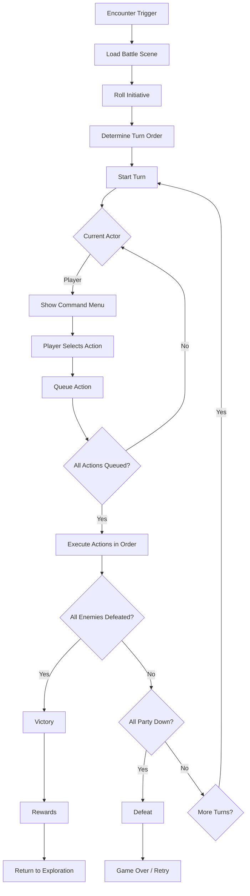

# Battle System

> **Purpose**: Define the turn-based combat system, battle flow, commands, and AI.  
> **Scope**: BattleManager, enemy AI, damage calculation, battle scene.  
> **Status**: Draft — to be refined during implementation.

---

## Overview

The battle system is turn-based, party vs. enemies, with AGI-based turn ordering. Players issue commands to party members, then actions resolve in order.



---

## BattleManager API

```gdscript
class_name BattleManager
extends Node

## Start a battle with an enemy group
func start_battle(enemy_group_id: String) -> void

## Queue a command for a party member
func queue_command(actor_id: String, command: BattleCommand) -> void

## Execute all queued actions
func execute_turn() -> void

## Get current battle state
func get_party() -> Array[BattleActor]
func get_enemies() -> Array[BattleActor]
func get_turn_order() -> Array[BattleActor]
func is_battle_over() -> bool
func is_player_turn() -> bool

## Auto-battle toggle
func toggle_auto_battle() -> void
```

---

## BattleCommand

```gdscript
class_name BattleCommand
extends Resource

@export var action_type: ActionType  # ATTACK, SKILL, GUARD, ITEM, FLEE
@export var actor_id: String
@export var target_id: String
@export var skill_id: String         # If SKILL
@export var item_id: String          # If ITEM
```

### Action Types

| Action | Description | Target |
|--------|-------------|--------|
| ATTACK | Basic physical attack | Single enemy |
| SKILL | Use a learned skill | Varies |
| GUARD | Defend, reduce damage | Self |
| ITEM | Use an item from inventory | Varies |
| FLEE | Attempt to escape | None |

---

## Damage Calculation

Physical ATK vs DEF formula with diminishing returns. Magical MAT vs MDF.
Element multipliers: 2x weakness, 0.5x resist, 0x null, -2x absorb.
Critical hits: 1.5x damage based on LUK.

---

## Turn Resolution

Turn order by AGI. Actors queue actions, then resolve in AGI order.

---

## Enemy AI

| AI Type | Behavior |
|---------|----------|
| aggressive | Attacks weakest party member |
| defensive | Guards or heals |
| caster | Uses skills randomly |
| balanced | Mixed behavior |
| basic | Simple attack |

---

## Status Effects

| Effect | Duration | Effect |
|--------|----------|--------|
| Poison | 3 turns | 10% HP damage per turn |
| Sleep | 1-2 turns | Cannot act |
| Paralysis | 1-2 turns | 50% chance to skip turn |
| Burn | 3 turns | 5% HP + ATK down |
| Freeze | 1-2 turns | Cannot act + DEF up |
| Blind | 2 turns | 30% miss chance |

---

## Rewards

Battle rewards include experience, currency, and items.

---

## Scene Architecture

```
Battle.tscn
├── Background
├── EnemyPanel with EnemySlot x6
├── PartyPanel with PartySlot x4
├── CommandMenu (Attack, Skill, Guard, Item, Flee)
├── BattleLog
└── AnimationPlayer
```

---

## Events

| Event | Data | When |
|-------|------|------|
| battle_started | enemy_group | Battle begins |
| action_executed | actor, action | Action resolves |
| actor_damaged | target, damage | Damage dealt |
| actor_defeated | actor | Actor falls |
| battle_victory | exp, items | Battle won |
| battle_defeat | none | Party wiped |

---

## Related

- [architecture.md](architecture.md)
- [game_design.md](game_design.md)
- [database.md](database.md)
- [event_system.md](event_system.md)
- [quest_system.md](quest_system.md)
- [inventory_system.md](inventory_system.md)

