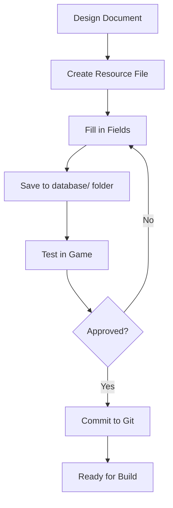

# Content Pipeline

> **Purpose**: Define the workflow for authoring game content: dialogue, quests, items, enemies.  
> **Scope**: Content creation tools, data entry, testing, version control.  
> **Status**: Draft — to be refined as content production begins.

---

## Overview

Content creation is data-driven. Writers, designers, and balancers create game content by editing Godot Resource files (.tres), not by writing code.

---

## Content Types

| Content | Created By | Tool | Storage |
|---------|------------|------|---------|
| Dialogue | Writer | Godot Inspector / Custom tool | DialogueResource (.tres) |
| Quests | Designer | Godot Inspector / Custom tool | QuestResource (.tres) |
| Items | Designer | Godot Inspector / Custom tool | ItemResource (.tres) |
| Enemies | Balancer | Godot Inspector / Custom tool | EnemyResource (.tres) |
| Skills | Balancer | Godot Inspector / Custom tool | SkillResource (.tres) |
| Maps | Designer | Godot Editor / TileMap | MapResource (.tres) + .tscn |
| Characters | Designer | Godot Inspector | CharacterResource (.tres) |

---

## Authoring Workflow



1. **Design Document**: Spec defines the content (dialogue script, quest design).
2. **Create Resource**: Right-click in Godot FileSystem → New Resource → Select type.
3. **Fill Fields**: Use Godot Inspector to set exported properties.
4. **Save**: Save `.tres` file to appropriate `database/` subfolder.
5. **Test**: Run the game and verify the content works correctly.
6. **Commit**: Commit to Git with a descriptive message.

---

## Data Validation

### Automated Checks

- All resource IDs are unique.
- All referenced resources exist (no broken paths).
- Required fields are filled (no empty IDs).
- Numeric values are within expected ranges.

### Manual Review

- Dialogue reads naturally.
- Quest objectives are achievable.
- Item values are balanced.
- Enemy stats are appropriate for the region.

---

## Version Control for Content

- `.tres` files are text-based (human-readable diffs).
- Large assets (textures, audio) use Git LFS.
- Each content change is a separate commit.
- Commit messages follow: `content: type - description`

```
content: item - add health potion small
content: quest - design forest tutorial quest
content: dialogue - write prologue scene
```

---

## Localization Ready Content

All user-facing text uses string keys, not hardcoded text.

```gdscript
# In dialogue resource
@export var text_key: String = "dialogue_prologue_001"

# In string table
# dialogue_prologue_001: "Hello, world!"
```

String keys are extracted for translation before release.

---

## Content Review Checklist

- [ ] Resource file saved in correct folder.
- [ ] ID follows naming convention (type_region_name).
- [ ] All referenced resources exist.
- [ ] Text strings use localization keys.
- [ ] Values are within expected ranges.
- [ ] Tested in game (not just in editor).
- [ ] No console errors when loading.
- [ ] Committed with descriptive message.

---

## Related

- [database.md](database.md) — Resource definitions
- [resource_pipeline.md](resource_pipeline.md) — Asset creation
- [localization.md](localization.md) — String extraction
- [testing.md](testing.md) — Content testing
