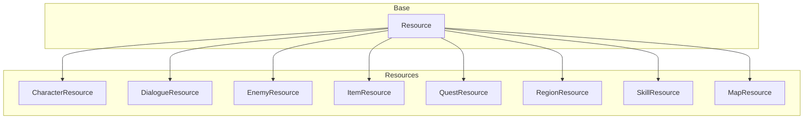

# Database

> **Purpose**: Define the data-driven architecture using Godot Resources.  
> **Scope**: All `.tres` and `.res` files in `database/`, their structure, and loading patterns.  
> **Status**: Draft — to be refined as resource types are defined.

---

## Principles

1. **All game content is data, not code.**
2. **Data is stored in Godot Resource files** (`.tres` / `.res`).
3. **Resources are type-safe, inheritable, and hot-reloadable.**
4. **New content is added by creating new resource files**, not modifying scripts.

---

## Resource Types



---

## Folder Layout

```
database/
├── characters/           # CharacterResource (.tres)
├── dialogue/             # DialogueResource (.tres)
├── enemies/              # EnemyResource (.tres)
├── items/                # ItemResource (.tres)
├── maps/                 # MapResource (.tres)
├── quests/               # QuestResource (.tres)
├── regions/              # RegionResource (.tres)
└── skills/               # SkillResource (.tres)
```

---

## Loading Strategy

### Lazy Loading with Caching

Resources are **loaded lazily** on first access and **cached permanently** for the session.

```gdscript
# Database internal implementation pattern:
var _cache: Dictionary = {}

func get_item(item_id: String) -> Resource:
    var cache_key: String = "items/" + item_id
    if _cache.has(cache_key):
        return _cache[cache_key]
    
    var path: String = "res://database/items/%s.tres" % item_id
    var resource: Resource = load(path)
    
    if resource == null:
        push_error("Database: Item not found: %s" % item_id)
        EventBus.emit_event("resource_missing", {"id": item_id, "path": path})
        return null
    
    _cache[cache_key] = resource
    return resource
```

| Aspect | Decision | Rationale |
|--------|----------|-----------|
| Loading | Lazy (on first access) | Preloading 500+ resources at boot is slow; spreads cost across gameplay |
| Caching | Permanent (session lifetime) | Resources are immutable; no need to reload |
| Error handling | Push error + emit event | Silent failures cause hard-to-debug issues |
| Cache key | `"category/id"` | Unique, predictable, avoids ID collisions |

---

## Resource Definitions

### CharacterResource

```gdscript
class_name CharacterResource
extends Resource

@export var character_id: String          # Unique identifier
@export var display_name: String          # Localized name key
@export var portrait: Texture2D           # Dialogue portrait
@export var sprite: Texture2D             # Exploration sprite
@export var battle_sprite: Texture2D      # Battle sprite
@export var base_stats: StatsResource     # Base stats
@export var description: String           # Lore description
@export var starting_skills: Array[SkillResource]
```

*Location: `database/characters/`*

### DialogueResource

```gdscript
class_name DialogueResource
extends Resource

@export var dialogue_id: String           # Unique identifier
@export var lines: Array[DialogueLine]    # Ordered dialogue lines
@export var choices: Array[DialogueChoice] # Branching choices
@export var conditions: Array[DialogueCondition]
@export var on_start_events: Array[EventData]
@export var on_end_events: Array[EventData]
```

*Location: `database/dialogue/`*

### EnemyResource

```gdscript
class_name EnemyResource
extends Resource

@export var enemy_id: String              # Unique identifier
@export var display_name: String          # Localized name
@export var sprite: Texture2D             # Battle sprite
@export var stats: StatsResource          # Base stats
@export var skills: Array[SkillResource]  # Available skills
@export var exp_reward: int               # Experience on defeat
@export var item_drops: Array[ItemDrop]   # Potential loot
@export var element: ElementType          # Element affinity
```

*Location: `database/enemies/`*

### ItemResource

```gdscript
class_name ItemResource
extends Resource

@export var item_id: String               # Unique identifier
@export var item_name: String             # Localized name
@export var description: String           # Localized description
@export var icon: Texture2D               # Inventory icon
@export var item_type: ItemType           # Consumable, Equipment, Key
@export var value: int                    # Sell/buy price
@export var max_stack: int                # Max stack size
@export var effects: Array[ItemEffect]    # On-use effects
@export var equip_slot: EquipSlot         # If equipment
@export var stat_modifiers: Dictionary    # If equipment
```

*Location: `database/items/`*

### QuestResource

```gdscript
class_name QuestResource
extends Resource

@export var quest_id: String              # Unique identifier
@export var title: String                 # Localized title
@export var description: String           # Localized description
@export var quest_type: QuestType         # Main, Side, Event
@export var stages: Array[QuestStage]     # Ordered stages
@export var prerequisites: Array[String]  # Required quest IDs
@export var rewards: QuestReward          # EXP, items, currency
@export var on_complete_events: Array[EventData]
```

*Location: `database/quests/`*

### RegionResource

```gdscript
class_name RegionResource
extends Resource

@export var region_id: String             # Unique identifier
@export var display_name: String          # Localized name
@export var world_map_position: Vector2   # Position on world map
@export var map_ids: Array[String]        # Maps in this region
@export var enemy_groups: Array[EnemyGroupData] # Random encounters
@export var available_quests: Array[String] # Quest IDs
@export var required_flag: String         # Story flag to unlock
```

*Location: `database/regions/`*

---

```gdscript
# Example: Access an item resource
var item: ItemResource = Database.get_item("potion_small")
if item:
    print(item.item_name)

# Example: Load all enemies in a region
var enemies: Array[EnemyResource] = Database.get_region_enemies("forest_region")
```

### Database (Core Autoload)

```gdscript
class_name Database
extends Node

# API
func get_item(item_id: String) -> ItemResource
func get_enemy(enemy_id: String) -> EnemyResource
func get_character(character_id: String) -> CharacterResource
func get_quest(quest_id: String) -> QuestResource
func get_region(region_id: String) -> RegionResource
func get_dialogue(dialogue_id: String) -> DialogueResource
func get_skill(skill_id: String) -> SkillResource
func get_map(map_id: String) -> MapResource
func get_all_items() -> Array[ItemResource]
func get_all_quests() -> Array[QuestResource]
```

---

## Resource Inheritance

Create base resources for common patterns:

```
ItemResource (base class)
├── ConsumableItemResource (adds effect data)
├── EquipmentResource (adds stat modifiers, slot)
└── KeyItemResource (adds story flag)
```

```gdscript
class_name ConsumableItemResource
extends ItemResource

@export var effects: Array[ItemEffect]
@export var target_type: TargetType  # Self, Ally, Enemy, All
```

---

## Adding New Content

To add new game content:

1. Define the resource class in `scripts/core/` (if not exists).
2. Create a new `.tres` file in the appropriate `database/` folder.
3. Fill in the exported fields through the Godot Inspector.
4. Register the resource ID in a content registry if needed.
5. The game loads it through Database without code changes.

---

## Future Considerations

- **Encryption**: `.tres` files can be encrypted for distribution.
- **Modding**: Mods can override resources by loading from a `mods/` path.
- **DLC**: Additional resource files loaded from DLC path.
- **Localization**: String keys reference locale files; resources themselves are locale-independent.

---

## Related

- [architecture.md](architecture.md) — Data flow principles
- [folder_structure.md](folder_structure.md) — Database folder layout
- [managers.md](managers.md) — How managers access data
- [content_pipeline.md](content_pipeline.md) — Content authoring
- [resource_pipeline.md](resource_pipeline.md) — Asset creation

