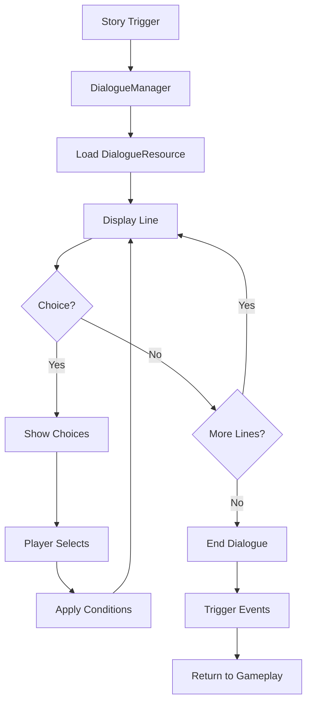
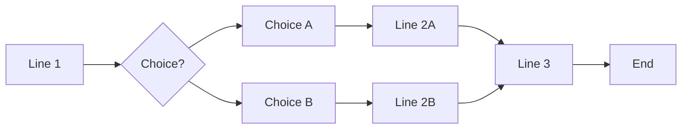

# Dialogue System (Visual Novel)

> **Purpose**: Define the Visual Novel dialogue system, data format, branching, and integration.  
> **Scope**: DialogueManager, dialogue resources, VN scene, choice system.  
> **Status**: Draft — to be refined during implementation.

---

## Overview

The dialogue system powers the Visual Novel segments of the game. It loads dialogue data from resources, displays text with character portraits, handles branching choices, and triggers game events.



---

## DialogueManager API

```gdscript
class_name DialogueManager
extends Node

## Start a dialogue sequence
func start_dialogue(dialogue_id: String) -> void

## Advance to the next line
func advance() -> void

## Make a dialogue choice
func make_choice(index: int) -> void

## Skip to the end of current dialogue
func skip_to_end() -> void

## Check if dialogue is currently active
func is_dialogue_active() -> bool

## Get current dialogue state
func get_current_line() -> DialogueLine
func get_current_speaker() -> CharacterResource
func get_available_choices() -> Array[DialogueChoice]
```

---

## DialogueResource Format

```gdscript
class_name DialogueResource
extends Resource

@export var dialogue_id: String           # Unique identifier
@export var background: Texture2D         # VN background art
@export var lines: Array[DialogueLine]    # Ordered dialogue lines
@export var on_start_events: Array[EventData]   # Events on start
@export var on_end_events: Array[EventData]     # Events on end
```

### DialogueLine

```gdscript
class_name DialogueLine
extends Resource

@export var speaker_id: String
@export var text: String
@export var emotion: String
@export var next_line: String
@export var conditions: Array[DialogueCondition]
@export var on_display_events: Array[EventData]
```

### DialogueChoice

```gdscript
class_name DialogueChoice
extends Resource

@export var text: String
@export var target_line: String
@export var conditions: Array[DialogueCondition]
@export var effects: Array[DialogueEffect]
```

---

## Branching System



### Condition System

```gdscript
class_name DialogueCondition
extends Resource

@export var type: ConditionType
@export var key: String
@export var operator: Operator
@export var value: Variant
```

### Effect System

```gdscript
class_name DialogueEffect
extends Resource

@export var type: EffectType
@export var key: String
@export var value: Variant
```

---

## Scene Architecture

```
VisualNovel.tscn (CanvasLayer)
├── Background (TextureRect)
├── CharacterSprites (Node2D)
├── DialoguePanel (Control)
│   ├── NameLabel (Label)
│   ├── TextLabel (RichTextLabel)
│   └── NextIndicator (TextureRect)
├── ChoicePanel (Control)
│   └── ChoiceButton (Button) x4
├── QuickMenu (HBoxContainer)
│   ├── AutoButton (Button)
│   ├── SkipButton (Button)
│   └── LogButton (Button)
└── DialogueLog (Panel)
```

---

## Integration Points

- **Save System**: Current dialogue ID, line index, flags.
- **Quest System**: Dialogue can start or update quests.
- **Inventory**: Dialogue can grant or remove items.
- **Relationships**: Dialogue choices affect relationship values.
- **Audio**: Each line can trigger voice clips and BGM changes.

## Events

| Event | Data | When |
|-------|------|------|
| `dialogue_started` | `{ "dialogue_id": String }` | Dialogue begins |
| `dialogue_ended` | `{ "dialogue_id": String }` | Dialogue ends |
| `dialogue_choice_made` | `{ "choice_index": int }` | Player makes choice |

---

## Related

- [architecture.md](architecture.md) — Module architecture
- [game_design.md](game_design.md) — Visual Novel design
- [database.md](database.md) — Dialogue resource structure
- [event_system.md](event_system.md) — Dialogue events
- [save_system.md](save_system.md) — Saving dialogue state

