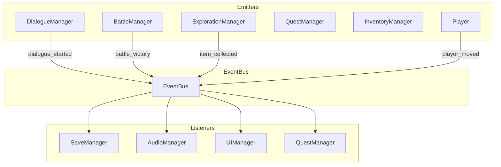

# Event System

> **Purpose**: Define the global event bus, signal patterns, and communication guidelines.  
> **Scope**: Inter-module communication through EventBus.  
> **Status**: Draft — to be refined as events are defined.

---

## Principles

1. **Events are notifications, not commands.**
2. **Event data is read-only for listeners.**
3. **Events never contain game logic.**
4. **Listeners should never assume a specific emitter.**
5. **Any system can emit any event.**

---

## EventBus Architecture



---

## EventBus API

```gdscript
class_name EventBus
extends Node

# === Public API ===

## Emit an event to all listeners
func emit_event(event_name: String, data: Dictionary = {}) -> void

## Register a listener for an event
func listen(event_name: String, callback: Callable) -> void

## Remove a listener
func unlisten(event_name: String, callback: Callable) -> void

## Check if an event has any listeners
func has_listeners(event_name: String) -> bool
```

### Usage Example

```gdscript
# Emitter
EventBus.emit_event("item_collected", {
    "item_id": "potion_small",
    "quantity": 2,
    "player_id": "hero"
})

# Listener
func _ready() -> void:
    EventBus.listen("item_collected", _on_item_collected)

func _on_item_collected(data: Dictionary) -> void:
    var item_id: String = data.get("item_id", "")
    var quantity: int = data.get("quantity", 0)
    print("Collected %d x %s" % [quantity, item_id])
```

---

## Event Naming

### Convention

```text
system_action
```

- Lowercase snake_case.
- Past tense for completed actions: `battle_started`, `item_used`.
- Present tense for ongoing states: `dialogue_active`, `game_paused`.

### Examples

| Event | Data | Emitter | Listeners |
|-------|------|---------|-----------|
| `game_started` | `{ "slot": int }` | SaveManager | UIManager, AudioManager |
| `scene_changed` | `{ "from": String, "to": String }` | SceneManager | AudioManager, SaveManager |
| `dialogue_started` | `{ "dialogue_id": String }` | DialogueManager | UIManager |
| `dialogue_ended` | `{ "dialogue_id": String }` | DialogueManager | QuestManager |
| `battle_started` | `{ "enemy_group": String }` | BattleManager | AudioManager |
| `battle_victory` | `{ "exp": int, "items": Array }` | BattleManager | QuestManager, InventoryManager |
| `battle_defeat` | `{}` | BattleManager | SaveManager |
| `item_collected` | `{ "item_id": String, "quantity": int }` | ExplorationManager | InventoryManager, UIManager |
| `item_used` | `{ "item_id": String, "target": String }` | InventoryManager | BattleManager |
| `quest_started` | `{ "quest_id": String }` | QuestManager | UIManager |
| `quest_completed` | `{ "quest_id": String }` | QuestManager | UIManager, InventoryManager |
| `player_moved` | `{ "position": Vector2 }` | PlayerController | ExplorationManager |
| `player_interacted` | `{ "target": String }` | PlayerController | DialogueManager |
| `game_saved` | `{ "slot": int }` | SaveManager | UIManager |
| `game_loaded` | `{ "slot": int }` | SaveManager | All |
| `game_paused` | `{}` | UIManager | All |
| `game_resumed` | `{}` | UIManager | All |
| `audio_bgm_changed` | `{ "bgm_id": String }` | AudioManager | UIManager |

---

## Data Convention

Event data always uses `Dictionary`:

```gdscript
{
    "entity_id": "hero",      # Who triggered it
    "action": "collected",    # What happened
    "target": "potion_small", # What was affected
    "value": 2,               # Quantifiable change
    "metadata": {}            # Any extra context
}
```

Minimum data that listeners need. Avoid passing large objects.

---

## Listener Lifecycle

```gdscript
func _ready() -> void:
    EventBus.listen("battle_started", _on_battle_started)

func _exit_tree() -> void:
    # Always clean up listeners when the node is removed
    EventBus.unlisten("battle_started", _on_battle_started)

func _on_battle_started(data: Dictionary) -> void:
    # Handle event
    pass
```

- Always `unlisten` in `_exit_tree()`.
- Nodes that are freed without unlistening will cause errors.
- Use weak references where possible for long-lived listeners.

---

## Performance Considerations

- Events are lightweight (Dictionary + String).
- Avoid emitting events every frame from frequently updated systems.
- If high-frequency events are needed (e.g., position updates), batch them.
- Maximum recommended event rate: ~30 events/second.
- For per-frame communication, use direct method calls instead.

---

## Future Expansion

- **Typed Events**: Strongly-typed event classes for important events.
- **Event Logging**: Debug mode that logs all event traffic.
- **Networked Events**: Events that sync across network in multiplayer.
- **Event History**: Rollback support for replays/debugging.

---

## Related

- [architecture.md](architecture.md) — Communication architecture
- [autoloads.md](autoloads.md) — EventBus as autoload
- [managers.md](managers.md) — Manager communication
- [dialogue_system.md](dialogue_system.md) — Dialogue events
- [battle_system.md](battle_system.md) — Battle events
- [quest_system.md](quest_system.md) — Quest events
- [save_system.md](save_system.md) — Save events


