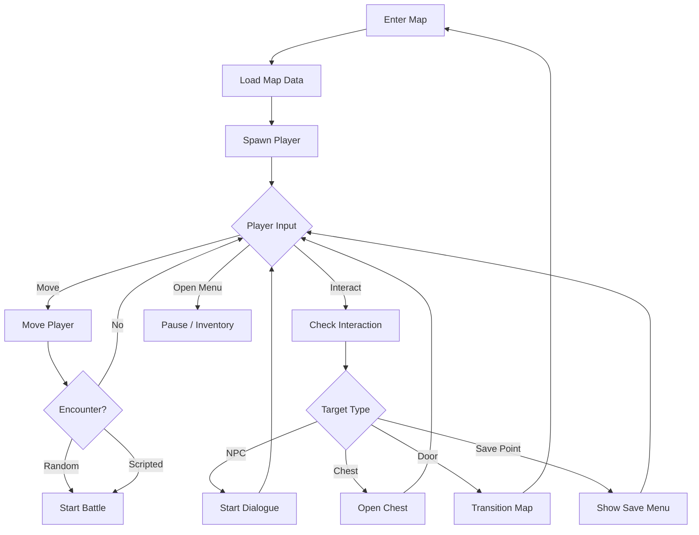

# Exploration System

> **Purpose**: Define the 2D side-scrolling exploration system, movement, interaction, and map management.  
> **Scope**: ExplorationManager, player controller, interactables, map transitions.  
> **Status**: Draft — to be refined during implementation.

---

## Overview

Exploration is the core gameplay mode where players move through 2D side-scrolling environments, interact with NPCs and objects, discover secrets, and encounter enemies.



---

## ExplorationManager API

```gdscript
class_name ExplorationManager
extends Node

## Initialize a map
func load_map(map_id: String) -> void

## Get current map info
func get_current_map() -> String
func get_player_position() -> Vector2
func get_player_facing() -> String

## Interaction
func interact_with(target: Node) -> void
func is_near_interactable() -> bool
func get_nearest_interactable() -> Node

## Movement control
func can_move() -> bool
func set_movement_locked(locked: bool) -> void

## Camera
func get_camera_bounds() -> Rect2
func shake_camera(intensity: float, duration: float) -> void
```

---

## Player Controller

```gdscript
class_name PlayerController
extends CharacterBody2D

@export var speed: float = 150.0
@export var run_speed: float = 250.0
@export var jump_velocity: float = -300.0
@export var acceleration: float = 10.0
@export var friction: float = 15.0

func _physics_process(delta: float) -> void:
    handle_movement(delta)
    handle_interaction()
    handle_menu_input()
```

### Movement Features

- Smooth acceleration and deceleration.
- Run toggle (Shift / Left Trigger).
- Jump on platforms (Space / A Button).
- Climb on ladders.
- Dash with cooldown (Q / Right Bumper).

---

## Map System

```gdscript
class_name MapResource
extends Resource

@export var map_id: String
@export var display_name: String
@export var scene_path: String           # Path to .tscn file
@export var enemy_groups: Array[EnemyGroupData]
@export var encounter_rate: float        # Steps between encounters
@export var connections: Array[MapConnection]
@export var ambient_bgm: AudioStream
@export var ambient_sfx: AudioStream
@export var camera_limits: Rect2
```

### Map Connection

```gdscript
class_name MapConnection
extends Resource

@export var from_map: String
@export var to_map: String
@export var connection_point: Vector2    # Where player appears
@export var required_flag: String        # Story flag to unlock
```

---

## Interactables

| Type | Script | Behavior |
|------|--------|----------|
| NPC | `npc.gd` | Dialogue trigger |
| Chest | `chest.gd` | Grant items |
| Door | `door.gd` | Map transition |
| Portal | `portal.gd` | Teleport |
| Save Point | `save_point.gd` | Save menu |
| Collectible | `collectible.gd` | Item pickup |
| Trigger Zone | `trigger_zone.gd` | Scripted events |

### Interactable Base

```gdscript
class_name Interactable
extends Area2D

@export var interaction_prompt: String
@export var one_time: bool = false
@export var required_flag: String
@export var on_interact_events: Array[EventData]

func on_interact(player: PlayerController) -> void:
    pass
```

---

## Encounter System

- **Random Encounters**: Based on step counter and encounter_rate.
- **Scripted Encounters**: Triggered by events, quests, or story flags.
- **Enemy Groups**: Defined in MapResource.
- **Encounter Avoidance**: Lower-level enemies flee; high-level increase rate.

```gdscript
func check_random_encounter() -> bool:
    var rate: float = get_current_map_data().encounter_rate
    var roll: float = randf()
    # Rate increases with steps since last encounter
    var modified_rate: float = rate * (1.0 + _steps_since_encounter * 0.01)
    return roll < modified_rate
```

---

## Scene Architecture

```
Exploration.tscn (Node2D)
├── MapRoot (Node2D)
│   ├── Terrain (TileMap)
│   ├── Environment (Node2D)
│   │   ├── Props (StaticBody2D)
│   │   ├── Platforms (StaticBody2D)
│   │   └── Decorations (Node2D)
│   ├── Interactables (Node2D)
│   │   ├── NPC (NPC.tscn) x N
│   │   ├── Chest (Chest.tscn) x N
│   │   └── Portal (Portal.tscn) x N
│   ├── EncounterZones (Node2D)
│   └── Triggers (Area2D) x N
├── Player (CharacterBody2D)
│   ├── Sprite (AnimatedSprite2D)
│   ├── Collision (CollisionShape2D)
│   └── Camera (Camera2D)
├── InteractionPrompt (Control)
├── MiniMap (TextureRect) — optional
└── TransitionOverlay (ColorRect)
```

---

## Events

| Event | Data | When |
|-------|------|------|
| `map_entered` | `{ "map_id": String }` | Player enters a map |
| `map_exited` | `{ "from": String, "to": String }` | Player leaves a map |
| `player_moved` | `{ "position": Vector2 }` | Player changes position |
| `player_interacted` | `{ "target": String }` | Player interacts |
| `item_collected` | `{ "item_id": String, "quantity": int }` | Item picked up |
| `encounter_triggered` | `{ "enemy_group": String }` | Random encounter |

---

## Related

- [architecture.md](architecture.md) — Module architecture
- [game_design.md](game_design.md) — Exploration design
- [database.md](database.md) — Map resources
- [event_system.md](event_system.md) — Exploration events
- [dialogue_system.md](dialogue_system.md) — NPC interaction
- [scene_architecture.md](scene_architecture.md) — Room scene pattern
