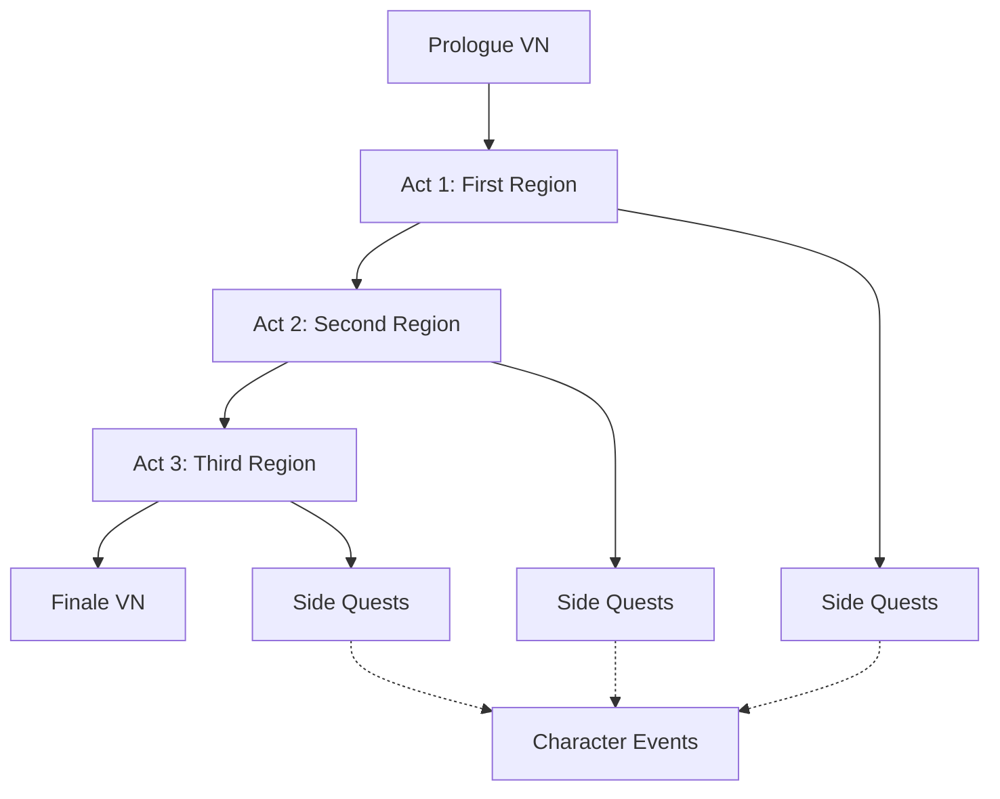
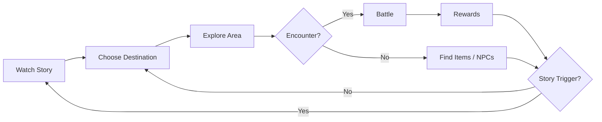

# Game Design Document

> **Purpose**: Define the core game concept, mechanics, player experience, and content scope.  
> **Scope**: All gameplay systems and their intended player-facing behavior.  
> **Status**: Draft — to be refined as features are prototyped.

---

## Game Concept

**SariaMod** is a **2D RPG + Visual Novel hybrid** that blends:

- **Visual Novel segments** for story progression and character interaction.
- **World Map navigation** for selecting locations.
- **2D side-scrolling exploration** with NPCs, items, and puzzles.
- **Turn-based RPG battles** with a party system.

The game emphasizes narrative, character relationships, and exploration over grinding mechanics.

---

## Genre

| Aspect | Classification |
|--------|----------------|
| Primary Genre | RPG |
| Secondary Genre | Visual Novel |
| Perspective | Side-scrolling (exploration), Front-facing (battle) |
| Camera | 2D, fixed camera per room |
| Battle System | Turn-based, party-based |

---

## Story Structure

- **Main Story**: Linear progression through 3+ regions.
- **Side Content**: Optional quests, character events, exploration.
- **Branching**: Dialogue choices affect relationships and minor story outcomes.
- **Endings**: Multiple endings based on key choices and relationship values.

---

## Core Gameplay Loop

1. **Watch Story** — Visual Novel dialogue with choices.
2. **Choose Destination** — Select a region or location on the world map.
3. **Explore Area** — Move through 2D side-scrolling environments.
4. **Encounter Enemies** — Random or scripted encounters trigger turn-based battles.
5. **Earn Rewards** — Experience, items, currency, relationship points.
6. **Progress Story** — Reach story triggers to advance the narrative.

---

## Player Progression

### Character Stats

| Stat | Description |
|------|-------------|
| HP | Health points. Zero = incapacitated. |
| SP | Skill points. Consumed by abilities. |
| ATK | Physical attack power. |
| DEF | Physical defense. |
| MAT | Magic attack power. |
| MDF | Magic defense. |
| AGI | Turn order speed. |
| LUK | Critical rate, status effect chance. |

### Experience & Leveling

- Enemies grant EXP on defeat.
- EXP accumulates toward next level.
- Leveling increases stats (fixed or scaled).
- No level cap (practical cap around 50-99).

### Relationships

- NPCs have relationship values (0-100).
- Dialogue choices affect relationship values.
- High relationships unlock side content, items, or battle bonuses.

---

## Visual Novel System

| Feature | Details |
|---------|---------|
| Dialogue Display | Text box with character name, portrait, text |
| Choices | 2-4 options per choice point |
| Branching | Conditional flags, relationship checks |
| Backgrounds | Full-screen art per scene |
| Character Sprites | Expressive portraits with multiple states |
| Auto-Advance | Optional auto-read mode |
| Skip | Read/unread skip toggle |
| Log | Scrollable dialogue history |

---

## Exploration System

| Feature | Details |
|---------|---------|
| Movement | 2D side-scrolling, left/right, jump |
| Camera | Follows player, bounded to room |
| Interactables | NPCs, chests, doors, quest items |
| Zones | Room-based areas with transitions |
| Mini-map | Optional area overview |
| Secrets | Hidden paths, breakable walls |
| Save Points | Interactable save locations |

---

## Battle System

| Feature | Details |
|---------|---------|
| Type | Turn-based, party vs. enemies |
| Party Size | Up to 4 active members |
| Enemy Groups | 1-6 enemies per encounter |
| Commands | Attack, Skill, Guard, Item, Flee |
| Turn Order | AGI-based with speed modifications |
| Status Effects | Poison, Sleep, Paralysis, Burn, Freeze, etc. |
| Element System | Fire, Water, Earth, Wind, Light, Dark |
---

## Content Scope

| Content Type | Minimum Target | Ideal Target |
|-------------|----------------|--------------|
| Regions | 3 | 5+ |
| Maps / Rooms | 30 | 60+ |
| NPCs | 50 | 200+ |
| Dialogue Lines | 2,000 | 10,000+ |
| Enemies | 30 | 80+ |
| Skills | 40 | 100+ |
| Items | 60 | 150+ |
| Quests (Main) | 15 | 25+ |
| Quests (Side) | 20 | 50+ |
| Battle Backgrounds | 10 | 25+ |

---

## Save System

- Save anywhere (outside battle).
- 100 save slots.
- Auto-save at scene transitions and after battles.
- Save data includes: story flags, quest progress, inventory, party, position, relationships.

---

## Target Audience

| Aspect | Target |
|--------|--------|
| Age | 13+ |
| Platform | Windows (Steam) |
| Language | English (localization-ready) |
| Playtime | 15-30 hours (main story) |
| Difficulty | Moderate, adjustable |

---

## Design Pillars

1. **Story First** — Every system serves the narrative.
2. **Choices Matter** — Player decisions have visible consequences.
3. **Exploration Rewarded** — Secrets, items, and lore for curious players.
4. **Accessible Depth** — Easy to learn, satisfying to master.
5. **Polished Presentation** — Visual Novel quality storytelling.

---

## Related

- [architecture.md](architecture.md) — System architecture supporting these mechanics
- [dialogue_system.md](dialogue_system.md) — Visual Novel implementation
- [battle_system.md](battle_system.md) — Combat implementation
- [exploration_system.md](exploration_system.md) — Exploration implementation
- [quest_system.md](quest_system.md) — Quest design
- [inventory_system.md](inventory_system.md) — Item design
- [save_system.md](save_system.md) — Save architecture

