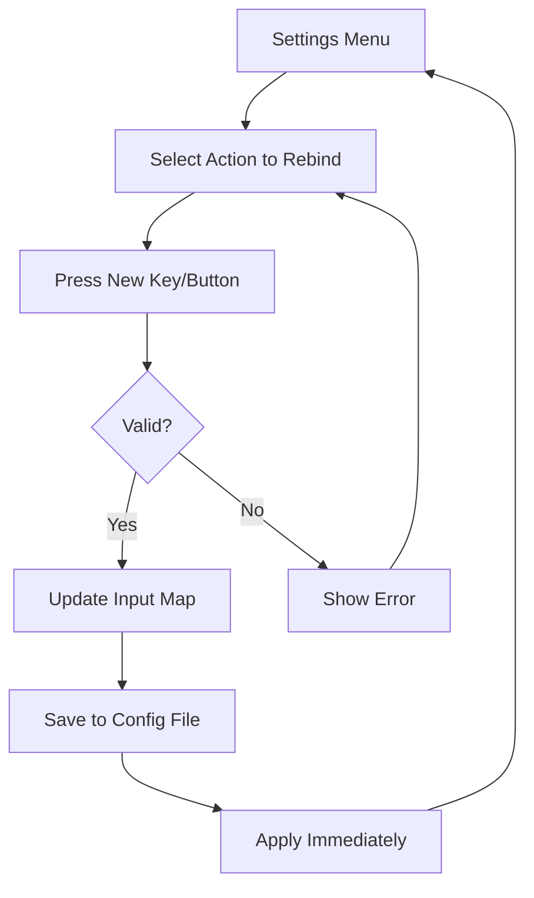

# Input System

> **Purpose**: Define input mapping conventions, controller support, and rebinding architecture.  
> **Scope**: All player input across gameplay modes.  
> **Status**: Draft — to be refined as input actions are defined.

---

## Principles

1. **Input is abstracted through actions, not key bindings.**
2. **Different gameplay modes have different input contexts.**
3. **Players can rebind controls through the settings menu.**
4. **Controller and keyboard are supported simultaneously.**
5. **Input is managed centrally through InputManager (autoload).**

---

## Input Actions

All input actions are defined in `project.godot` under the Input Map.

### Global Actions (Always Active)

| Action | Keyboard | Controller | Purpose |
|--------|----------|------------|---------|
| `ui_accept` | Enter / Space | A Button | Confirm / Interact |
| `ui_cancel` | Esc | B Button | Back / Cancel |
| `ui_pause` | Esc | Start | Pause menu |
| `ui_menu` | Tab | Select | Open inventory/quest |
| `ui_quick_save` | F5 | - | Quick save |

### Exploration Actions

| Action | Keyboard | Controller | Purpose |
|--------|----------|------------|---------|
| `move_left` | A / Left | Left Stick Left | Move left |
| `move_right` | D / Right | Left Stick Right | Move right |
| `move_up` | W / Up | Left Stick Up | Look up / climb |
| `move_down` | S / Down | Left Stick Down | Crouch / descend |
| `jump` | Space | A Button | Jump |
| `interact` | E | X Button | Interact with objects |
| `run` | Shift | Left Trigger | Sprint |
| `dash` | Q | Right Bumper | Dash / evade |

### Battle Actions

| Action | Keyboard | Controller | Purpose |
|--------|----------|------------|---------|
| `battle_attack` | 1 | A Button | Attack command |
| `battle_skill` | 2 | X Button | Skill command |
| `battle_guard` | 3 | Y Button | Guard command |
| `battle_item` | 4 | B Button | Item command |
| `battle_flee` | 5 | Back | Attempt flee |
| `battle_confirm` | Enter | A Button | Confirm selection |
| `battle_cancel` | Esc | B Button | Cancel selection |
| `battle_cursor_up` | W / Up | D-Pad Up | Navigate targets |
| `battle_cursor_down` | S / Down | D-Pad Down | Navigate targets |
| `battle_cursor_left` | A / Left | D-Pad Left | Navigate targets |
| `battle_cursor_right` | D / Right | D-Pad Right | Navigate targets |

### Visual Novel Actions

| Action | Keyboard | Controller | Purpose |
|--------|----------|------------|---------|
| `vn_advance` | Enter / Space | A Button | Next line |
| `vn_auto` | A | X Button | Toggle auto-read |
| `vn_skip` | S | Y Button | Skip to next choice |
| `vn_log` | L | Right Bumper | Open dialogue log |
| `vn_choice_1` | 1 | D-Pad Up | Select choice 1 |
| `vn_choice_2` | 2 | D-Pad Right | Select choice 2 |
| `vn_choice_3` | 3 | D-Pad Down | Select choice 3 |
| `vn_choice_4` | 4 | D-Pad Left | Select choice 4 |

---

## Input Contexts

Input actions are grouped by context. Only one context is active at a time.

| Context | Active When | Managed By |
|---------|-------------|------------|
| `global` | Always | InputManager |
| `exploration` | Player is exploring | ExplorationManager |
| `battle` | Battle is active | BattleManager |
| `visual_novel` | Dialogue is active | DialogueManager |
| `menu` | Any menu is open | UIManager |

### Context Activation

```gdscript
# Switch to battle input context
InputManager.push_context("battle")
# Return to previous context
InputManager.pop_context()
# Check current context
var active_context: String = InputManager.get_active_context()
```

---

## InputManager API

```gdscript
class_name InputManager
extends Node

# --- Context Management ---
func push_context(context: String) -> void
func pop_context() -> void
func get_active_context() -> String

# --- Rebinding ---
func rebind_action(action: String, event: InputEvent) -> bool
func reset_action(action: String) -> void
func reset_all_to_defaults() -> void
func get_action_bindings(action: String) -> Array[InputEvent]

# --- Query ---
func is_action_just_pressed(action: String) -> bool
func is_action_pressed(action: String) -> bool
func is_action_just_released(action: String) -> bool
func get_action_strength(action: String) -> float

# --- Settings ---
func load_keybindings() -> void
func save_keybindings() -> void
```

---

## Rebinding Flow



---

## Controller Support

### Controller Detection

```gdscript
InputManager.is_controller_connected() -> bool
InputManager.get_controller_name() -> String
InputManager.get_current_scheme() -> String
```

### Rumble / Vibration

```gdscript
InputManager.rumble(strength: float, duration: float)
```

### Automatic Scheme Switching

- When a controller is connected, UI prompts show controller icons.
- When keyboard/mouse input is detected, UI switches to keyboard prompts.
- Scheme change emits event: `control_scheme_changed`.

---

## Implementation Checklist

- [ ] Define all input actions in project.godot Input Map.
- [ ] Create autoload/input_manager.gd with context support.
- [ ] Implement rebinding UI in settings screen.
- [ ] Add controller detection and scheme switching.
- [ ] Save/load keybindings from config file.

---

## Future Considerations

- **Steam Input API**: Full controller customization through Steam.
- **Accessibility**: Allow mouse-only and single-button modes.
- **Touch Controls**: Virtual joystick for Steam Deck.

---

## Related

- [architecture.md](architecture.md) — InputManager module
- [autoloads.md](autoloads.md) — InputManager as autoload
- [ui_system.md](ui_system.md) — Settings UI for rebinding
