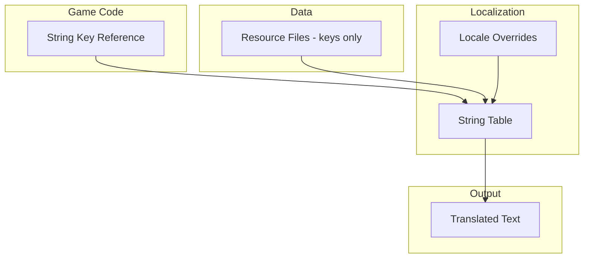

# Localization

> **Purpose**: Define the localization architecture, string extraction, and translation workflow.  
> **Scope**: String tables, locale switching, font support, RTL languages.  
> **Status**: Draft — to be implemented after core systems are stable.

---

## Overview

The game is designed for localization from the start. All user-facing text uses string keys. Localization assets are separate from game data, allowing translation without modifying content.

---

## Architecture



---

## String Keys

```gdscript
# Convention: context_section_identifier
"dialogue_prologue_001"
"item_potion_small_name"
"item_potion_small_desc"
"quest_forest_tutorial_title"
"ui_menu_inventory"
"npc_elder_greeting"
```

Keys are:
- Descriptive enough to identify the content.
- Organized by context (dialogue, item, quest, ui, npc).
- Never changed after release (to preserve translations).

---

## String Table Format

```gdscript
class_name StringTable
extends Resource

@export var locale: String              # "en", "ja", "ko", "zh", etc.
@export var strings: Dictionary = {
    # "key": "Translated string"
}
```

### File Structure

```
assets/strings/
├── string_table_en.tres      # English (source)
├── string_table_ja.tres      # Japanese
├── string_table_ko.tres      # Korean
├── string_table_zh.tres      # Chinese (Simplified)
└── ...
```

---

## Locale Switching

```gdscript
# Set the active locale
LocaleManager.set_locale("ja")

# Get a localized string
var text: String = LocaleManager.get_string("dialogue_prologue_001")
# Returns the Japanese translation if available, falls back to English.
```

### Fallback Chain

1. Selected locale (e.g., `ja`).
2. System locale (auto-detected on first launch).
3. English (default fallback).

---

## Font Support

| Script | Font Requirement |
|--------|------------------|
| Latin | Standard .ttf, no special chars |
| Japanese | Font with Kanji, Hiragana, Katakana |
| Korean | Font with Hangul |
| Chinese | Font with Hanzi (Simplified/Traditional) |
| Cyrillic | Font with Cyrillic characters |

### Font Override

```gdscript
@export var locale_fonts: Dictionary = {
    "ja": preload("res://assets/fonts/noto_sans_jp.ttf"),
    "ko": preload("res://assets/fonts/noto_sans_kr.ttf"),
    "zh": preload("res://assets/fonts/noto_sans_sc.ttf"),
}
```

---

## RTL / Special Cases

- Right-to-left languages (Arabic, Hebrew) require `CanvasItem.text_direction` override.
- Text alignment may need adjustment per locale.
- UI layout should not hardcode positions based on text length.

---

## String Extraction

Before release, extract all string keys from resources:

1. Scan all `.tres` files in `database/` for export fields marked as localization keys.
2. Collect unique keys into a master list.
3. Generate a base `string_table_en.tres` with empty values.
4. Send to translators.
5. Import completed translation files.

---

## Implementation Timeline

| Phase | Task |
|-------|------|
| Pre-Production | Design string key convention |
| Production | Write all text with keys, not hardcoded strings |
| Pre-Release | Extract strings, send for translation |
| Release | Ship with English only |
| Post-Release | Ship locale packs as updates |

---

## Related

- [architecture.md](architecture.md) — Localization considerations
- [database.md](database.md) — Resource design with keys
- [content_pipeline.md](content_pipeline.md) — Content authoring
