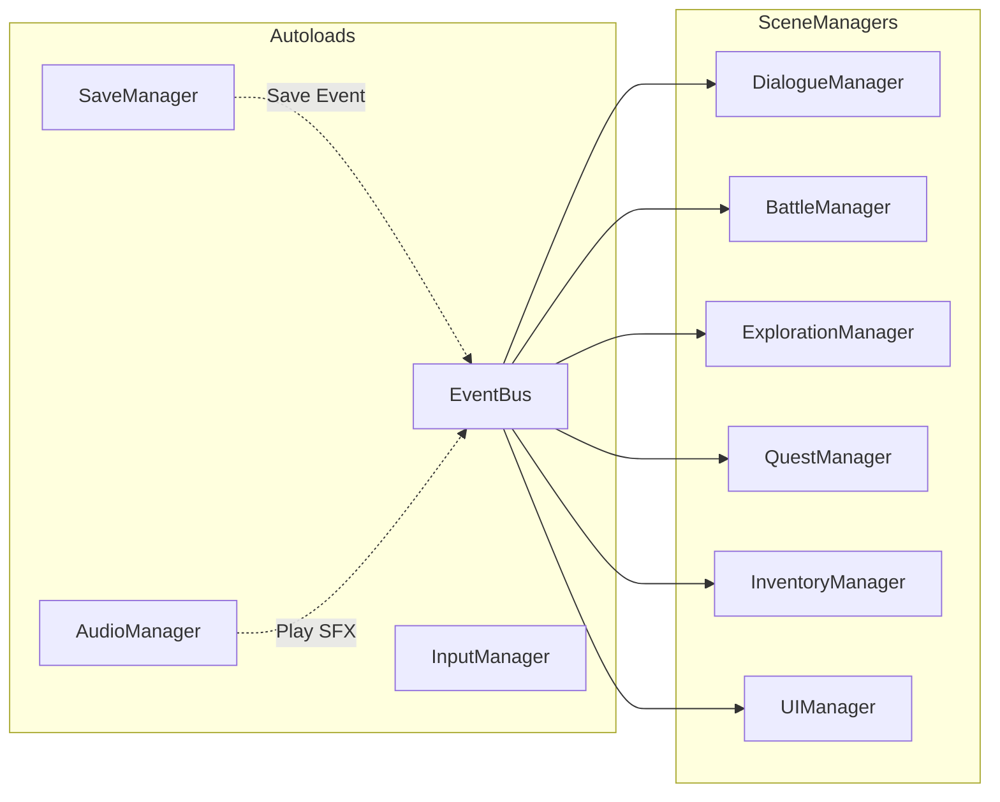

# Managers

> **Purpose**: Document all manager classes, their responsibilities, APIs, and dependencies.  
> **Scope**: Both autoloaded managers (global) and scene-based managers (per-scene).  
> **Status**: Draft — to be refined as managers are implemented.

---

## Manager Types

| Type | Count | Examples |
|------|-------|---------|
| **Autoload Manager** | 7 | EventBus, Database, SaveManager, AudioManager, InputManager, UIManager, SceneManager |
| **Scene Manager** | 5 | DialogueManager, BattleManager, ExplorationManager, QuestManager, InventoryManager |

---

## Autoload Managers

Documented in detail in [autoloads.md](autoloads.md).

| Manager | Autoload | Purpose |
|---------|----------|---------|
| EventBus | Yes | Global event dispatch |
| Database | Yes | Resource loading & caching |
| SaveManager | Yes | Save/load game state |
| AudioManager | Yes | Audio playback |
| InputManager | Yes | Input mapping + contexts |
| UIManager | Yes | UI screen stack, HUD, notifications |
| SceneManager | Yes | Scene transitions, loading, fades |

---

## Scene Managers

These managers are instantiated per-scene or exist as part of a specific game state. They access autoloads through EventBus and read data from Database.

### DialogueManager

| Property | Value |
|----------|-------|
| Script | `scripts/managers/dialogue_manager.gd` |
| Scene | Instantiated by VisualNovel scene |
| Purpose | Load and display dialogue, handle choices |
| Dependencies | EventBus, Database |

```gdscript
# API
func start_dialogue(dialogue_key: String) -> void
func advance() -> void
func make_choice(index: int) -> void
func is_dialogue_active() -> bool
func skip_to_end() -> void
```

### BattleManager

| Property | Value |
|----------|-------|
| Script | `scripts/managers/battle_manager.gd` |
| Scene | Instantiated by Battle scene |
| Purpose | Manage turn-based combat |
| Dependencies | EventBus, Database |

```gdscript
# API
func start_battle(enemy_group_id: String) -> void
func execute_command(actor_id: String, command: BattleCommand) -> void
func get_party_members() -> Array[BattleActor]
func get_enemies() -> Array[BattleActor]
func is_battle_over() -> bool
```

### ExplorationManager

| Property | Value |
|----------|-------|
| Script | `scripts/managers/exploration_manager.gd` |
| Scene | Instantiated by Exploration scene |
| Purpose | Player movement, interaction, map state |
| Dependencies | EventBus |

```gdscript
# API
func get_player_position() -> Vector2
func interact_with(target: Node) -> void
func is_exploration_active() -> bool
func get_current_map() -> String
```

### QuestManager

| Property | Value |
|----------|-------|
| Script | `scripts/managers/quest_manager.gd` |
| Scene | Scene-based (instantiated when needed) |
| Purpose | Track quest progress and completion |
| Dependencies | EventBus, Database |

```gdscript
# API
func start_quest(quest_id: String) -> bool
func advance_quest(quest_id: String, stage_id: String) -> bool
func complete_quest(quest_id: String) -> bool
func fail_quest(quest_id: String) -> bool
func get_active_quests() -> Array[QuestData]
func get_completed_quests() -> Array[String]
```

### InventoryManager

| Property | Value |
|----------|-------|
| Script | `scripts/managers/inventory_manager.gd` |
| Scene | Scene-based (accessible through EventBus) |
| Purpose | Manage items, equipment, currency |
| Dependencies | EventBus, Database |

```gdscript
# API
func add_item(item_id: String, quantity: int = 1) -> bool
func remove_item(item_id: String, quantity: int = 1) -> bool
func get_item_count(item_id: String) -> int
func equip_item(character_id: String, item_id: String) -> bool
func unequip_item(character_id: String, slot: String) -> bool
func get_currency() -> int
func add_currency(amount: int) -> void
```

### SceneManager

| Property | Value |
|----------|-------|
| Script | `autoload/scene_manager.gd` |
| Scene | Autoload (registered in project.godot) |
| Purpose | Handle scene transitions, loading screens, fade effects |
| Dependencies | EventBus, UIManager |

```gdscript
# API
func change_scene(scene_path: String, data: Dictionary = {}) -> void
func change_scene_with_overlay(scene_path: String, overlay_path: String, data: Dictionary = {}) -> void
func reload_current_scene() -> void
func get_current_scene() -> Node
func get_current_scene_path() -> String
func fade_to_black(duration: float) -> Signal
func fade_from_black(duration: float) -> Signal
```

SceneManager is the **only** system that calls `get_tree().change_scene_to_file()`. All scene transitions go through it.

---

## Communication Pattern



Scene managers never call autoloads directly. They emit events that autoloads may respond to.

---

## Manager Checklist

When creating a new manager:

- [ ] Does it need to be global? → Autoload (see [autoloads.md](autoloads.md))
- [ ] Does it exist per-scene? → Scene manager
- [ ] Does it already conflict with an existing manager?
- [ ] Are its dependencies clearly stated?
- [ ] Is its API documented here?

---

## Prohibited Patterns

- Managers calling other managers' internal methods directly.
- Managers sharing mutable state outside EventBus.
- Scene managers duplicating autoload functionality.

---

## Related

- [architecture.md](architecture.md) — Module responsibilities
- [autoloads.md](autoloads.md) — Autoload details
- [event_system.md](event_system.md) — Communication patterns
- [database.md](database.md) — Data access
