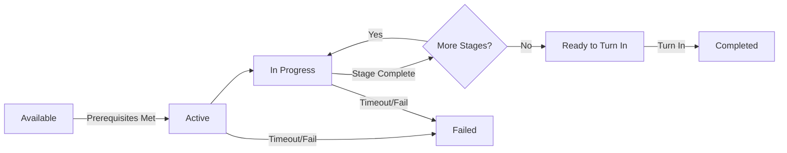

# Quest System

> **Purpose**: Define quest lifecycle, data format, tracking, and rewards.  
> **Scope**: QuestManager, quest resources, quest log UI.  
> **Status**: Draft — to be refined during implementation.

---

## Overview

Quests are story-driven or optional objectives that guide player progression. They have multiple stages, conditions, and rewards.

---

## Quest Lifecycle



### States

| State | Description |
|-------|-------------|
| HIDDEN | Not yet discoverable |
| AVAILABLE | Prerequisites met, not yet started |
| ACTIVE | Player accepted the quest |
| IN_PROGRESS | At least one stage started |
| COMPLETED | All stages done, waiting for turn-in |
| FINISHED | Rewards granted |
| FAILED | Quest conditions failed |

---

## QuestManager API

```gdscript
class_name QuestManager
extends Node

## Quest lifecycle
func accept_quest(quest_id: String) -> bool
func advance_quest(quest_id: String, stage_id: String) -> bool
func complete_quest(quest_id: String) -> bool
func fail_quest(quest_id: String) -> bool

## Queries
func get_quest_state(quest_id: String) -> QuestState
func get_active_quests() -> Array[QuestData]
func get_completed_quests() -> Array[String]
func is_quest_completed(quest_id: String) -> bool

## Objective tracking
func update_objective(quest_id: String, objective_id: String, progress: int) -> void
func get_objective_progress(quest_id: String, objective_id: String) -> int
```

---

## QuestResource

```gdscript
class_name QuestResource
extends Resource

@export var quest_id: String
@export var title: String
@export var description: String
@export var quest_type: QuestType     # MAIN, SIDE, EVENT, REPEATABLE
@export var prerequisites: Array[QuestPrerequisite]
@export var stages: Array[QuestStage]
@export var rewards: QuestReward
@export var failure_conditions: Array[QuestCondition]
@export var on_start_events: Array[EventData]
@export var on_complete_events: Array[EventData]
```

### QuestStage

```gdscript
class_name QuestStage
extends Resource

@export var stage_id: String
@export var description: String
@export var objectives: Array[QuestObjective]
@export var on_enter_events: Array[EventData]
@export var on_exit_events: Array[EventData]
```

### QuestObjective

```gdscript
class_name QuestObjective
extends Resource

@export var objective_id: String
@export var description: String
@export var objective_type: ObjectiveType
# TALK_TO, DEFEAT_ENEMY, COLLECT_ITEM, REACH_LOCATION, USE_ITEM, CUSTOM
@export var target_id: String            # NPC, enemy, item, map ID
@export var required_count: int = 1
@export var current_count: int = 0
```

---

## Quest Rewards

```gdscript
class_name QuestReward
extends Resource

@export var experience: int
@export var currency: int
@export var items: Array[ItemDrop]
@export var skills: Array[SkillResource]
@export var relationship_changes: Array[RelationChange]
@export var flags_to_set: Array[String]
```

---

## Quest Log UI

```
QuestLog.tscn (Control)
├── QuestList (VBoxContainer)
│   ├── QuestEntry (Button) — active quests
│   └── QuestEntry — completed quests (collapsed)
├── QuestDetail (Panel)
│   ├── TitleLabel (Label)
│   ├── DescriptionLabel (Label)
│   ├── ObjectivesList (VBoxContainer)
│   │   ├── ObjectiveEntry (HBoxContainer)
│   │   │   ├── CheckIcon (TextureRect)
│   │   │   └── TextLabel (Label)
│   └── RewardList (VBoxContainer)
└── CloseButton (Button)
```

---

## Events

| Event | Data | When |
|-------|------|------|
| quest_started | quest_id | Quest accepted |
| quest_stage_changed | quest_id, stage_id | Stage advances |
| quest_completed | quest_id | Quest finished |
| quest_failed | quest_id | Quest failed |

---

## Related

- [architecture.md](architecture.md)
- [game_design.md](game_design.md)
- [database.md](database.md)
- [event_system.md](event_system.md)
- [dialogue_system.md](dialogue_system.md) — Quest dialogue triggers
- [ui_system.md](ui_system.md) — Quest log UI
