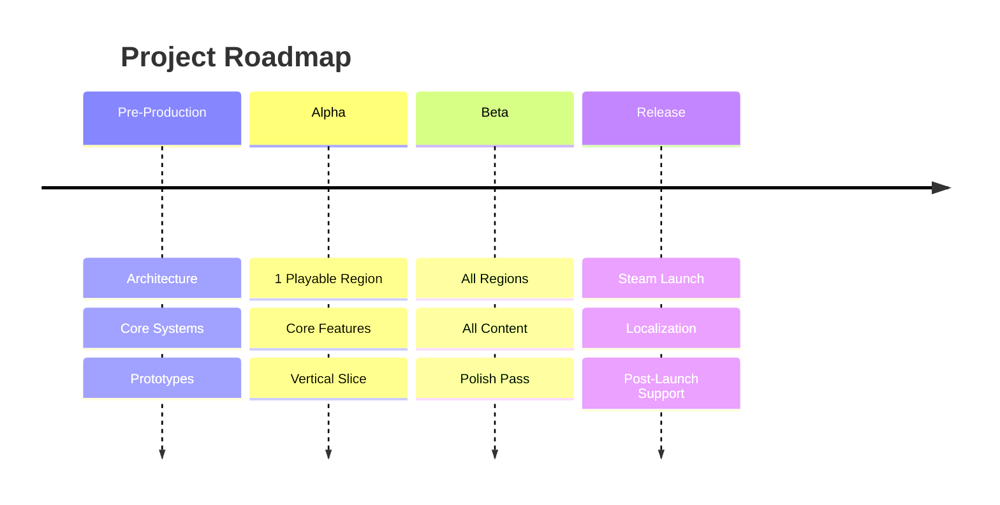

# Roadmap

> **Purpose**: Define long-term project milestones, versions, and targets.  
> **Type**: Living document — update as milestones are achieved.  
> **Last Updated**: 2026-07-03

---

## Vision

A polished 2D RPG + Visual Novel hybrid with 15-30 hours of gameplay, 3+ regions, and hundreds of NPCs. Released on Steam.

---

## Milestones



---

## Phase 1: Pre-Production

**Target: Q2 2026 — COMPLETED**

| Milestone | Status | Notes |
|-----------|--------|-------|
| Documentation system | ✅ DONE | 28+ documents created |
| Project setup (Godot 4.x) | ✅ DONE | project.godot, imports, 7 autoloads |
| Folder structure created | ✅ DONE | assets/, scripts/, scenes/, database/ |
| Core autoloads (EventBus, Save, Audio, Input) | ✅ DONE | 7 autoloads implemented |
| Database system | ✅ DONE | Lazy loading with cache |
| Boot + Main Menu scene | ✅ DONE | Splash, main menu, transitions |
| Core resource definitions | ✅ DONE | 9 resource classes |
| SceneManager + UIManager | ✅ DONE | Transitions, fades, screen stack |
| Visual Novel Framework | ✅ DONE | 37 files — commands, compiler, manager, UI, docs |
| World Navigation System | ✅ DONE | 21 files — NavigationManager, WorldMap, RegionHub, BuildingInterior |
| Sample world data | ✅ DONE | 2 regions, 4 buildings, 1 shop, 2 region connections |

**Deliverable**: Bootable project with main menu and core infrastructure.

---

## Phase 2: Prototype

**Target: Q3 2026**

Phase 2 delivers ONE fully playable region demonstrating every core gameplay loop.

The plan follows a vertical slice approach — each milestone ends with a playable improvement.  
Save integration is incremental: each system becomes saveable immediately after implementation.  
Sample data is built alongside each system, not postponed to the end.

### Milestone 1: "Boot to VN" — Visual Novel Playable

| | |
|---|---|
| **Goal** | Player boots the game, sees main menu, watches the prologue VN with text and choices |
| **Why now** | Entry point to all content. No gameplay can be tested without it |
| **Complexity** | Low |
| **Playable result** | Boot → Main Menu → Prologue VN (text, portraits, choices) |

**Tasks**:
- [ ] Create 4 essential VN scenes: `visual_novel.tscn`, `vn_dialogue_box.tscn`, `vn_portrait.tscn`, `vn_choice_menu.tscn`
- [ ] Verify connection to existing VNManager scripts
- [ ] Wire Boot → Main Menu → VN → sample_prologue.dialogue
- [ ] Test full playthrough of prologue

### Milestone 2: "Walk" — Player Movement

| | |
|---|---|
| **Goal** | Player can move a character in a 2D space with camera following |
| **Why now** | Movement is the primary interaction mode. Everything else builds on it |
| **Complexity** | Low |
| **Playable result** | Walk around a simple map with camera following |

**Tasks**:
- [x] Create `player.tscn` (CharacterBody2D + CollisionShape2D + AnimatedSprite2D + Camera2D)
- [x] Implement `player_controller.gd` (movement, acceleration, direction facing, collision)
- [x] Create `placeholder_map.tscn` (simple ground tilemap + wall borders)
- [x] Wire player input to InputManager context
- [x] Create 1 sample character resource for the hero

### Milestone 3.0: "Talk" — NPC Interaction → VN

| | |
|---|---|
| **Goal** | Player walks up to an NPC, presses interact, VN dialogue opens |
| **Why now** | Bridges exploration to content. NPCs are how players receive quests, story, shops |
| **Complexity** | Low |
| **Reference** | `scripts/components/interactable.gd`, `scripts/world/player_controller.gd` |
| **Playable result** | Walk → see NPC → press E → VN dialogue → choices → close |

### Sub-milestone 3.1: Interaction Foundation ✅ DONE

**Tasks**:
- [x] Create `interactable.gd` base class (Area2D, prompt, one_time, can_interact, interact)
- [x] Create `test_interactable.gd` (demo: prints "Interaction successful.")
- [x] Add interaction detection + input to PlayerController
- [x] Instance test interactable in placeholder map

### Sub-milestone 3.2: NPC Subclass ✅ DONE

**Tasks**:
- [x] Create `npc.gd` (extends Interactable, exports dialogue_id)
- [x] Create `npc.tscn` (Area2D + CollisionShape2D)
- [x] Instance NPC in placeholder map with dialogue_id override

### Sub-milestone 3.3: NPC → Visual Novel Integration ✅ DONE

**Tasks**:
- [x] Register VNManager as autoload in project.godot
- [x] Wire NPC.interact() to VNManager.start_dialogue()
- [x] Update VNPanel to use autoload VNManager, handle NPC return
- [x] Disable player movement during VN via InputManager context

### Sub-milestone 3.4: Player Interaction Input ✅ DONE

**Tasks**:
- [x] Review and verify interaction detection (nearest, single-press, range)
- [x] Fix NPC context leak on dialogue start failure
- [x] Validate all edge cases (no NPC, multiple, invalid, out of range, during dialogue)

### Sub-milestone 3.5: Sample NPC Content ✅ DONE

**Tasks**:
- [x] Create Dialogue A (simple greeting, 1 line)
- [x] Create Dialogue B (multi-line conversation, 3 lines)
- [x] Add compile-on-demand fallback to NPC.gd
- [x] Place both NPCs in placeholder map with unique dialogue_ids

**Milestone M3 — "Talk" COMPLETE** 🎉

### Milestone 4: "World Flow" — Navigation Integration

| | |
|---|---|
| **Goal** | Player flows through VN → World Map → Region Hub → Building → Exploration |
| **Why now** | World Navigation scenes exist. Wiring them creates the full world structure |
| **Complexity** | Medium |
| **Playable result** | Watch VN → World Map → click region → enter hub → enter building → walk → exit back |

**Tasks**:
- [ ] Wire VN end → SceneManager → WorldMap
- [ ] Wire WorldMap region selection → RegionHub (with region data)
- [ ] Wire RegionHub building selection → BuildingInterior
- [ ] Wire BuildingInterior → placeholder exploration map
- [ ] Wire Exploration exit → RegionHub
- [ ] Implement SceneManager pending data pattern (spec exists)
- [ ] Test full navigation loop

### Milestone 5: "Fight" — Battle Foundation

| | |
|---|---|
| **Goal** | Player encounters an enemy, enters battle, uses Attack, wins or loses |
| **Why now** | Core gameplay loop. Everything after (quests, rewards) depends on battle |
| **Complexity** | High |
| **Playable result** | Walk → press B (test trigger) → enter battle → Attack → win/lose → return to exploration |

**Tasks**:
- [ ] Implement `battle_manager.gd` (state machine, AGI turn order, Attack command)
- [ ] Implement `battle_actor.gd` (stat access, HP/SP management)
- [ ] Create 4 battle scenes (root, command menu, party panel, enemy panel, battle log)
- [ ] Create manual encounter trigger for testing
- [ ] Create 2 sample enemies + 1 enemy group + 1 skill
- [ ] Add party state to save data

### Milestone 6: "Fight Smarter" — Full Command Set

| | |
|---|---|
| **Goal** | Full battle commands: Skills, Items, Guard, Flee |
| **Why now** | Completes battle system before rewards integration |
| **Complexity** | Medium |
| **Playable result** | Full turn-based combat with all commands |

**Tasks**:
- [ ] Add Skill command (selection, SP cost, targeting, execution)
- [ ] Add Item command (selection from inventory, execution)
- [ ] Add Guard (50% damage reduction)
- [ ] Add Flee (AGI-based success chance)
- [ ] Expand damage calc (elemental multipliers, critical hits, status data)
- [ ] Create 3 more skills (Heal, Fire, Guard Up)

### Milestone 7: "Loot" — Inventory + Rewards

| | |
|---|---|
| **Goal** | Battle victory grants EXP, currency, items. Player can view/use/equip items |
| **Why now** | Rewards create the progression loop. Inventory makes rewards meaningful |
| **Complexity** | Medium |
| **Playable result** | Battle victory → items in inventory → open inventory → use potion → equip sword |

**Tasks**:
- [ ] Implement `inventory_manager.gd` (add/remove/use/equip/currency)
- [ ] Create inventory scenes (screen, item slot, category tabs, detail panel)
- [ ] Wire victory rewards (EXP → level, currency → wallet, items → inventory)
- [ ] Wire item usage (inventory screen + battle item command)
- [ ] Create 5 sample items (Potion, Hi-Potion, Antidote, Iron Sword, Leather Armor)
- [ ] Add inventory data to SaveManager

### Milestone 8: "Goal" — Quest System

| | |
|---|---|
| **Goal** | Player accepts a quest, completes objectives, claims rewards |
| **Why now** | Quests give purpose to everything built. Depends on all prior systems |
| **Complexity** | High |
| **Playable result** | Accept quest → defeat enemies → collect items → talk to NPC → complete → claim rewards |

**Tasks**:
- [ ] Implement `quest_manager.gd` (lifecycle, stage advancement, objective tracking)
- [ ] Create `quest_log.tscn` (quest list, detail, objectives, rewards)
- [ ] Wire VN dialogue → quest accept/complete commands
- [ ] Wire battle defeat → quest objective update
- [ ] Wire item collect → quest objective update
- [ ] Wire NPC talk → quest objective update
- [ ] Create 2 sample quests (main: Talk→Defeat→Return, side: Collect herbs)
- [ ] Add quest states to SaveManager

### Milestone 9: "Remember" — Save/Load

| | |
|---|---|
| **Goal** | Player saves the game, quits, loads, and continues exactly where they left off |
| **Why now** | Save serialization code exists per system. This milestone wires the UI |
| **Complexity** | Medium |
| **Playable result** | Play → save → quit → main menu → load → continue from exact state |

**Tasks**:
- [ ] Create `save_screen.tscn` (save slots, load buttons, confirm dialog, timestamps)
- [ ] Wire SaveManager to save screen
- [ ] Verify every system's to_dict/from_dict
- [ ] Test full save → load cycle (position, inventory, quests, VN vars, party, flags)

### Milestone 10: "Content" — Fill the Region

| | |
|---|---|
| **Goal** | One fully playable region with 15-30 minutes of content |
| **Why now** | All systems exist. Fill them with real content |
| **Complexity** | Medium |
| **Playable result** | Full prototype region playthrough |

**Tasks**:
- [ ] Create full exploration map (`verdant_forest.tscn`)
- [ ] Expand prologue dialogue to 50+ lines
- [ ] Create town NPC dialogue
- [ ] Create 3 more enemies
- [ ] Create 5 more items
- [ ] Create 1 more side quest
- [ ] Add random encounters to exploration map
- [ ] Full playthrough test: Boot to Save

### Milestone 11: "Polish" — Edge Cases + Cleanup

| | |
|---|---|
| **Goal** | No game-breaking bugs in the main loop |
| **Why now** | All content exists. Now harden it |
| **Complexity** | Low |
| **Playable result** | Polished prototype with no obvious bugs |

**Tasks**:
- [ ] Add settings screen (audio volume only)
- [ ] Add VN history panel + quick menu (if deferred)
- [ ] Fix edge cases: empty inventory, no quests, pre-state save, 1-enemy battle, game over
- [ ] Verify all scene transitions with save data
- [ ] Update documentation

---

## Phase 2 Gameplay Progression

```
After M1:  ✓ Boot  ✓ Main Menu  ✓ VN Prologue
After M2:  ✓ Walk  ✓ Camera  ✓ Collision
After M3:  ✓ Talk to NPC  ✓ NPC → VN Dialogue
After M4:  ✓ VN → World Map  ✓ Region Hub  ✓ Building  ✓ Exit
After M5:  ✓ Battle (Attack only)  ✓ Victory/Defeat
After M6:  ✓ Skills  ✓ Items in Battle  ✓ Guard  ✓ Flee
After M7:  ✓ Loot rewards  ✓ Inventory  ✓ Equip/Use Items
After M8:  ✓ Accept Quest  ✓ Track Objectives  ✓ Complete Quest
After M9:  ✓ Save  ✓ Load  ✓ Continue from Save
After M10: ✓ Full region exploration  ✓ 15-30 min prototype
After M11: ✓ Settings  ✓ Polish
```

**Deliverable**: One playable region with all core gameplay loops working end-to-end.

---

## Phase 3: Vertical Slice

**Target: Q4 2026**

| Milestone | Status | Notes |
|-----------|--------|-------|
| Region 1 fully implemented | ⬜ TODO | Maps, NPCs, quests — content expansion |
| Main story through Act 1 | ⬜ TODO | ~5,000 dialogue lines |
| Side quests (10+) | ⬜ TODO | Optional content |
| Enemy variety (20+) | ⬜ TODO | Different types, AI |
| Item variety (40+) | ⬜ TODO | Consumables, equipment |
| Polish pass | ⬜ TODO | Visual, audio, UX |

**Deliverable**: Vertical slice ready for internal testing.

---

## Phase 4: Full Production

**Target: Q1–Q2 2027**

| Milestone | Status | Notes |
|-----------|--------|-------|
| Region 2 implemented | ⬜ TODO | |
| Region 3 implemented | ⬜ TODO | |
| Full main story | ⬜ TODO | ~10,000 dialogue lines |
| Side quests (50+) | ⬜ TODO | |
| Enemy variety (80+) | ⬜ TODO | |
| Item variety (150+) | ⬜ TODO | |
| Audio complete (BGM, SFX) | ⬜ TODO | |

**Deliverable**: Complete game content.

---

## Phase 5: Beta & Polish

**Target: Q3 2027**

| Milestone | Status | Notes |
|-----------|--------|-------|
| Balance pass | ⬜ TODO | Difficulty, economy |
| Bug fixing | ⬜ TODO | Based on testing |
| Performance optimization | ⬜ TODO | 60 FPS target |
| Controller support | ⬜ TODO | Full controller testing |
| Save compatibility | ⬜ TODO | Version migration testing |

**Deliverable**: Beta build for external testers.

---

## Phase 6: Release

**Target: Q4 2027**

| Milestone | Status | Notes |
|-----------|--------|-------|
| Steam page setup | ⬜ TODO | |
| Localization (if scoped) | ⬜ TODO | |
| Achievements | ⬜ TODO | |
| Cloud saves | ⬜ TODO | |
| Release build | ⬜ TODO | |
| Post-launch support plan | ⬜ TODO | |

**Deliverable**: Steam release.

---

## Definition of Done for Phase 2

Every checkbox must be verifiable by playing the game:

- [ ] **Boot**: Game starts to main menu without errors
- [ ] **Main Menu**: New Game, Load, Settings, Quit buttons work
- [ ] **VN Prologue**: Full prologue plays with text, portraits, choices, variable tracking
- [ ] **World Map**: World map appears after prologue with selectable regions
- [ ] **Region Hub**: Entering a region shows buildings with names/types
- [ ] **Building Entry**: Entering a building transitions to interior/exploration scene
- [ ] **Player Movement**: Character moves with WASD/arrows, camera follows, collision works
- [ ] **NPC Interaction**: Walk to NPC → press E → VN dialogue opens → choices work
- [ ] **Scene Transitions**: All VN → World → Region → Building → Exploration transitions preserve player state
- [ ] **Battle**: Random or scripted encounter → battle scene → turn-based combat
- [ ] **Full Command Set**: Attack, Skill (SP cost), Item, Guard (50% damage), Flee (failure chance)
- [ ] **Damage Calculation**: ATK-DEF, elemental multipliers, critical hits
- [ ] **Victory**: Exp, currency, items rewarded → stats update
- [ ] **Defeat**: Game Over screen → retry or back to main menu
- [ ] **Inventory**: Open inventory → see items by category → view details → use/equip
- [ ] **Equipment**: Equip/unequip weapons and armor → stats change
- [ ] **Quest Accept**: Talk to NPC → accept quest → appears in quest log
- [ ] **Quest Objective Tracking**: Defeating enemies, collecting items, talking to NPCs updates quest progress
- [ ] **Quest Completion**: All objectives done → talk to NPC → receive rewards
- [ ] **Save**: Save to slot → shows timestamp, scene name
- [ ] **Load**: Load from main menu → all state restored (position, inventory, quests, VN variables, party)
- [ ] **Content**: 1 full region, 4+ enemies, 10+ items, 2+ quests, 3+ NPCs with dialogue, 1 exploration map
- [ ] **No game-breaking bugs**: Full playthrough from boot to save without crash or softlock

---

## Critical Path

```
M1: VN ──→ M4: World Flow
                ↓
M2: Walk ──→ M3: Talk ──→ M5: Battle ──→ M6: Full Battle ──→ M7: Loot ──→ M8: Quest ──→ M9: Save ──→ M10: Content ──→ M11: Polish
```

Each milestone is playable. No milestone contains more than ~3 days of work.

---

## Release Criteria

- [ ] Full playthrough from start to credits.
- [ ] All quests completable.
- [ ] No game-breaking bugs.
- [ ] 60 FPS on target hardware.
- [ ] Save/load works reliably across all scenes.
- [ ] Audio plays correctly throughout.
- [ ] Controller support works (if implemented).
- [ ] Localization complete (if in scope).

---

## Related

- [current_tasks.md](current_tasks.md) — Active tasks
- [release_checklist.md](release_checklist.md) — Release process
- [game_design.md](game_design.md) — Content scope
- [phase2_roadmap.md](phase2_roadmap.md) — Detailed Phase 2 implementation plan