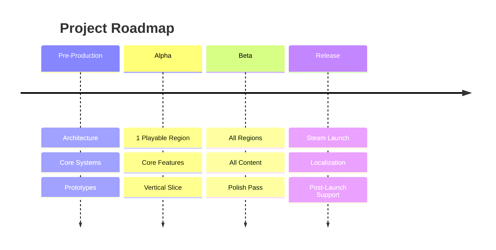

# Roadmap

> **Purpose**: Define long-term project milestones, versions, and targets.  
> **Type**: Living document — update as milestones are achieved.  
> **Last Updated**: 2026-06-28

---

## Vision

A polished 2D RPG + Visual Novel hybrid with 15-30 hours of gameplay, 3+ regions, and hundreds of NPCs. Released on Steam.

---

## Milestones

---

## Phase 1: Pre-Production

**Target: Q2 2026 — COMPLETED**

| Milestone | Status | Notes |
|-----------|--------|-------|
| Documentation system | ✅ DONE | 28+ documents created |
| Project setup (Godot 4.x) | ✅ DONE | project.godot, imports, 7 autoloads |
| Folder structure created | ✅ DONE | assets/, scripts/, scenes/, database/ |
| Core autoloads (EventBus, Save, Audio, Input) | ✅ DONE | 7 autoloads implemented |
| Database system | ✅ DONE | Lazy loading with cache |
| Boot + Main Menu scene | ✅ DONE | Splash, main menu, transitions |
| Core resource definitions | ✅ DONE | 9 resource classes |
| SceneManager + UIManager | ✅ DONE | Transitions, fades, screen stack |

**Deliverable**: Bootable project with main menu and core infrastructure.

---

## Phase 2: Prototype

**Target: Q3 2026**

| Milestone | Status | Notes |
|-----------|--------|-------|
| Visual Novel framework | ✅ DONE | 37 files — commands, compiler, manager, UI, docs |
| VN scene setup (editor) | ⬜ TODO | Create .tscn files in Godot editor |
| World Navigation system | ✅ DONE | 21 files — NavigationManager, WorldMap, RegionHub, BuildingInterior, data structures, sample data |
| Exploration prototype | ⬜ TODO | Movement, collision, interaction |
| Battle prototype | ⬜ TODO | Turn order, commands, damage |
| Inventory prototype | ⬜ TODO | Items, equipment, currency |
| Save/Load integration | ⬜ TODO | Connect UI to SaveManager |
| Sample database resources | ✅ DONE | 2 regions, 4 buildings, 1 shop, 2 region connections |

**Deliverable**: One playable region with all core gameplay loops.

---

## Phase 3: Vertical Slice

**Target: Q4 2026**

| Milestone | Status | Notes |
|-----------|--------|-------|
| Region 1 fully implemented | ⬜ TODO | Maps, NPCs, quests — data structure ready |
| Main story through Act 1 | ⬜ TODO | ~5,000 dialogue lines |
| Side quests (10+) | ⬜ TODO | Optional content |
| Enemy variety (20+) | ⬜ TODO | Different types, AI |
| Item variety (40+) | ⬜ TODO | Consumables, equipment |
| Polish pass | ⬜ TODO | Visual, audio, UX |

**Deliverable**: Vertical slice ready for internal testing.

---

## Phase 4: Full Production

**Target: Q1–Q2 2027**

| Milestone | Status | Notes |
|-----------|--------|-------|
| Region 2 implemented | ⬜ TODO | |
| Region 3 implemented | ⬜ TODO | |
| Full main story | ⬜ TODO | ~10,000 dialogue lines |
| Side quests (50+) | ⬜ TODO | |
| Enemy variety (80+) | ⬜ TODO | |
| Item variety (150+) | ⬜ TODO | |
| Audio complete (BGM, SFX) | ⬜ TODO | |

**Deliverable**: Complete game content.

---

## Phase 5: Beta & Polish

**Target: Q3 2027**

| Milestone | Status | Notes |
|-----------|--------|-------|
| Balance pass | ⬜ TODO | Difficulty, economy |
| Bug fixing | ⬜ TODO | Based on testing |
| Performance optimization | ⬜ TODO | 60 FPS target |
| Controller support | ⬜ TODO | Full controller testing |
| Save compatibility | ⬜ TODO | Version migration testing |

**Deliverable**: Beta build for external testers.

---

## Phase 6: Release

**Target: Q4 2027**

| Milestone | Status | Notes |
|-----------|--------|-------|
| Steam page setup | ⬜ TODO | |
| Localization (if scoped) | ⬜ TODO | |
| Achievements | ⬜ TODO | |
| Cloud saves | ⬜ TODO | |
| Release build | ⬜ TODO | |
| Post-launch support plan | ⬜ TODO | |

**Deliverable**: Steam release.

---

## Release Criteria

- [ ] Full playthrough from start to credits.
- [ ] All quests completable.
- [ ] No game-breaking bugs.
- [ ] 60 FPS on target hardware.
- [ ] Save/load works reliably across all scenes.
- [ ] Audio plays correctly throughout.
- [ ] Controller support works (if implemented).
- [ ] Localization complete (if in scope).

---

## Related

- [current_tasks.md](current_tasks.md) — Active tasks
- [release_checklist.md](release_checklist.md) — Release process
- [game_design.md](game_design.md) — Content scope
