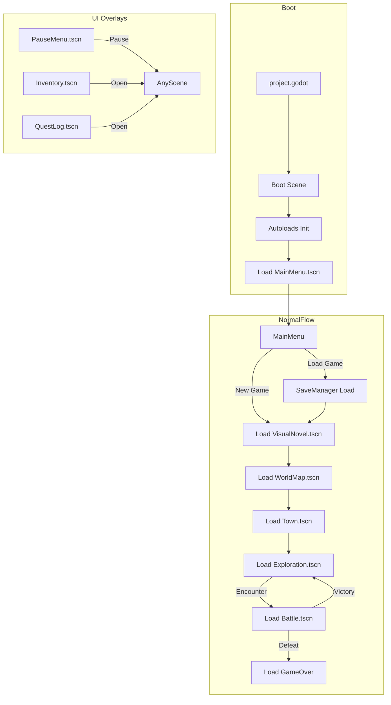

# Scene Architecture

> **Purpose**: Define scene composition patterns, node hierarchies, and reuse strategies.  
> **Scope**: All .tscn files and their structural conventions.  
> **Status**: Draft — to be refined as scenes are built.

---

## Principles

1. **Small reusable scenes** over giant scene trees.
2. **One responsibility per scene** — a scene should do one thing well.
3. **Composition over inheritance** — build complex scenes from simple sub-scenes.
4. **Logic in scripts, structure in scenes** — scenes define the tree; scripts define behavior.
5. **No hardcoded data in scenes** — use exported variables and resource references.

---

## Scene Types

| Type | Description | Example |
|------|-------------|---------|
| **Room** | Full-screen gameplay area | Exploration level, battle arena |
| **UI Overlay** | Rendered on top of gameplay | HUD, pause menu, dialogue box |
| **Entity** | Reusable game object | NPC, player, enemy, chest |
| **Component** | Sub-scene building block | Health bar, portrait frame |
| **Screen** | Full-screen non-gameplay | Main menu, save screen |

---

## Room Scene Pattern

```
Room (Node2D)
├── Background (Sprite2D / TileMap)
├── Environment (Node2D)
│   ├── Walls (StaticBody2D)
│   ├── Platforms (StaticBody2D)
│   └── Triggers (Area2D)
├── Interactables (Node2D)
│   ├── Chest (Chest.tscn)
│   ├── Door (Door.tscn)
│   └── NPC (NPC.tscn)
├── Player (CharacterBody2D)
│   └── Camera (Camera2D)
└── RoomBounds (Node2D)
    └── Collision (CollisionShape2D)
```

- Room scenes are loaded by SceneManager.
- Room bounds define camera limits.
- Interactables are child scenes with their own scripts.

---

## UI Overlay Pattern

```
HUD (CanvasLayer)
├── Layer (Node2D) — Layer 1
│   ├── HealthBar (TextureProgressBar)
│   ├── SPBar (TextureProgressBar)
│   └── CurrencyDisplay (Label)
├── Layer (Node2D) — Layer 2
│   ├── MiniMap (TextureRect)
│   └── QuestTracker (VBoxContainer)
└── Layer (Node2D) — Layer 3
    ├── Notification (Panel)
    └── Tooltip (Panel)
```

- UI scenes use `CanvasLayer` node as root.
- Layered by depth: HUD (bottom) → Menus (middle) → Dialogs (top).
- UI scenes are instantiated by UIManager.
- Never place UI inside room scenes.

---

## Entity Scene Pattern

```
NPC (CharacterBody2D)
├── Sprite (AnimatedSprite2D)
├── Collision (CollisionShape2D)
├── InteractionArea (Area2D)
│   └── Collision (CollisionShape2D)
├── SpeechBubble (Node2D)
│   └── Label (Label) — @export for text
└── Script: npc.gd
    ├── @export var npc_id: String
    ├── @export var display_name: String
    └── @export var dialogue_key: String
```

- Entities are self-contained with exported data references.
- Interaction areas handle proximity detection.
- Entities do not reference managers directly — use signals.

---

## Component Scene Pattern

```
HealthBar (Control)
├── Background (TextureRect)
├── Fill (TextureRect)
│   └── Tween (Tween) — smooth transitions
├── Label (Label) — "HP: 45/100"
└── Script: health_bar.gd
    ├── @export var max_value: int = 100
    ├── @export var current_value: int = 100
    ├── @export var bar_color: Color
    └── func set_values(current: int, max: int) -> void
```

- Components are reusable across multiple scenes.
- Components communicate through their exported API.
- Components never reference other systems directly.

---

## Scene Tree Depth

| Scene Type | Max Depth | Reason |
|------------|-----------|--------|
| Room | ≤ 5 | Keep room loading fast |
| UI Overlay | ≤ 6 | Deep UI = poor maintainability |
| Entity | ≤ 4 | Keep entities lightweight |
| Component | ≤ 3 | Components should be simple |
| Prefab | ≤ 2 | Instantiated many times |

---

## Instancing Rules

- **Instantiate** entities at runtime when they appear dynamically.
- **Preload** scenes used frequently (UI components, common enemies).
- **Load on demand** large scenes (rooms, battle backgrounds).
- **Do not instance scenes that reference managers** — pass data through exports.

```gdscript
# Preload example
const HealthBar = preload("res://scenes/ui/health_bar.tscn")

# Instantiation
var bar = HealthBar.instantiate()
bar.max_value = 100
bar.current_value = 50
add_child(bar)
```

---

## Inherited Scenes

Use inheritance only when:

- A scene is a variation of another scene with minor changes.
- The base scene is stable and not expected to change frequently.

Example:

```
BaseNPC.tscn
├── FriendlyNPC.tscn (inherits BaseNPC, adds shop logic)
└── HostileNPC.tscn (inherits BaseNPC, adds combat trigger)
```

Prefer composition over inheritance. Use `@export` to configure behavior instead of creating inherited scenes.

---

## Scene Loading Strategy



- Scene transitions use `SceneManager.change_scene()`.
- SceneManager handles loading screens, fading, cleanup.
- UI overlays are stacked, not swapped.

---

## Related

- [architecture.md](architecture.md) — Module architecture
- [folder_structure.md](folder_structure.md) — Where scenes go
- [ui_system.md](ui_system.md) — UI-specific patterns
- [managers.md](managers.md) — SceneManager and UIManager
