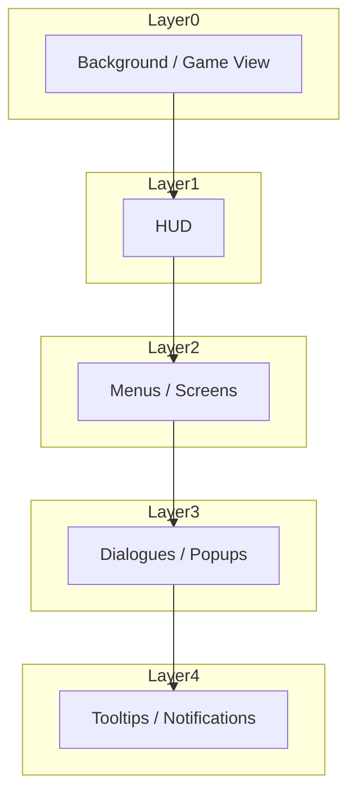
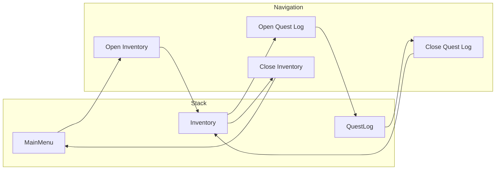

# UI System

> **Purpose**: Define UI architecture, component library, theming, and screen management.  
> **Scope**: UIManager, UI components, themes, screen stack.  
> **Status**: Draft — to be refined during implementation.

---

## Overview

The UI system manages all on-screen elements: HUD, menus, dialogue boxes, and overlays. It uses a screen stack for navigation and a UI theme for consistent styling.

---

## UI Layer Architecture



| Layer | Z-Index | Content |
|-------|---------|---------|
| 0 | 0 | Game world / 3D view |
| 1 | 10 | HUD (health, currency, minimap) |
| 2 | 20 | Full-screen menus (inventory, quest log) |
| 3 | 30 | Modal dialogs (confirmation, save) |
| 4 | 40 | Tooltips, notifications, toasts |

---

## UIManager API

```gdscript
class_name UIManager
extends Node

## Screen management
func open_screen(screen_id: String, data: Dictionary = {}) -> void
func close_screen(screen_id: String) -> void
func close_all_screens() -> void
func is_screen_open(screen_id: String) -> bool
func get_open_screens() -> Array[String]

## HUD
func show_hud() -> void
func hide_hud() -> void
func update_hud() -> void

## Notifications
func show_notification(text: String, type: NotificationType = INFO, duration: float = 2.0) -> void
func show_tooltip(text: String, position: Vector2) -> void
func hide_tooltip() -> void

## Transitions
func fade_to_black(duration: float = 0.5) -> void
func fade_from_black(duration: float = 0.5) -> void
```

---

## Registered Screens

| Screen ID | Scene | Type |
|-----------|-------|------|
| main_menu | MainMenu.tscn | Full screen |
| save_screen | SaveScreen.tscn | Full screen |
| inventory | InventoryScreen.tscn | Full screen |
| quest_log | QuestLog.tscn | Full screen |
| settings | SettingsScreen.tscn | Full screen |
| pause_menu | PauseMenu.tscn | Overlay |
| dialogue_box | DialogueBox.tscn | Overlay |
| confirmation | ConfirmationDialog.tscn | Modal |

---

## UI Theme

All UI elements use a global theme (`ui_theme.tres`) for consistent styling.

| Element | Themed Property |
|---------|----------------|
| Buttons | Colors, fonts, borders, hover states |
| Labels | Fonts, colors, sizes |
| Panels | Backgrounds, borders, margins |
| Progress bars | Fill colors, background colors |
| Scroll bars | Handle size, colors |
| Input fields | Background, cursor, font |

---

## HUD Components

```
HUD.tscn (CanvasLayer)
├── HealthBar (TextureProgressBar)
│   ├── Fill (TextureRect)
│   └── Label (Label) — "HP: 45/100"
├── SPBar (TextureProgressBar)
├── CurrencyDisplay (HBoxContainer)
│   ├── CurrencyIcon (TextureRect)
│   └── AmountLabel (Label)
├── QuestTracker (VBoxContainer)
│   └── QuestEntry (Label) x 3 max
├── MiniMap (TextureRect) — optional
└── NotificationContainer (VBoxContainer)
    └── Notification (Panel) — auto-removed
```

---

## Screen Stack



Screens are stacked. Only the top screen receives input. Closing a screen reveals the previous one.

---

## Component Library

Reusable components in `scenes/ui/`:

| Component | Description |
|-----------|-------------|
| Button.gd | Themed button with hover/click animations |
| IconButton.gd | Button with icon only |
| ProgressBar.gd | Animated fill bar |
| TabBar.gd | Tab navigation |
| Dropdown.gd | Dropdown selector |
| Slider.gd | Value slider |
| Toggle.gd | On/off toggle |
| TextInput.gd | Styled text field |
| ScrollContainer.gd | Scrollable content area |
| Tooltip.gd | Hover tooltip |
| Notification.gd | Auto-dismiss notification |

---

## Events

| Event | Data | When |
|-------|------|------|
| screen_opened | screen_id | Screen opened |
| screen_closed | screen_id | Screen closed |
| game_paused | none | Pause menu opened |
| game_resumed | none | Pause menu closed |
| notification_shown | text, type | Notification displayed |

---

## Related

- [architecture.md](architecture.md)
- [scene_architecture.md](scene_architecture.md)
- [managers.md](managers.md) — UIManager
- [event_system.md](event_system.md) — UI events
