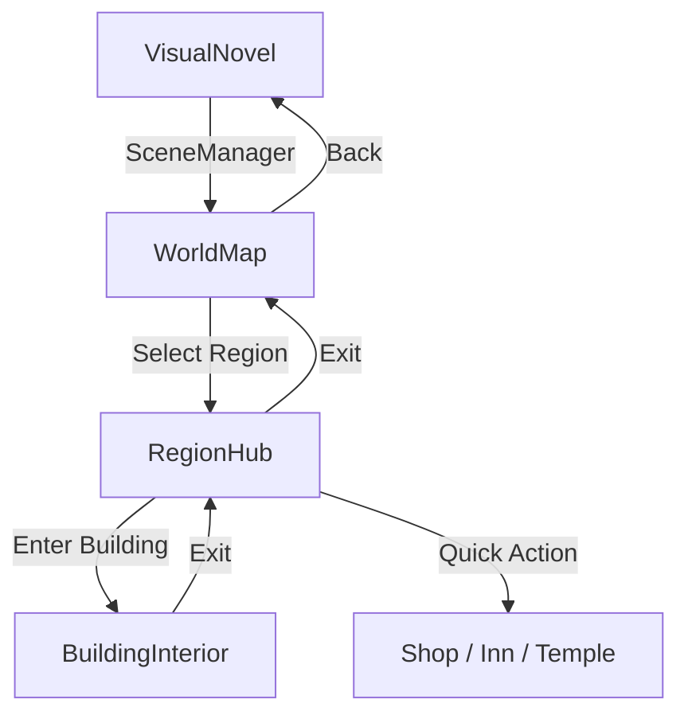

# World Navigation System

> **Purpose**: Define the world navigation system — the flow from World Map → Region → Building → Exploration.  
> **Scope**: NavigationManager, RegionResource, BuildingEntry, RegionConnection, ShopResource, and related scenes.  
> **Status**: Implemented — Phase 3 complete.

---

## Overview

The world navigation system manages the player's movement through the game world hierarchy:



Each level in the hierarchy has its own scene and controller script, with a shared **NavigationManager** that tracks state and validates transitions.

---

## Architecture

### Scene Flow

| Scene | Script | Purpose |
|-------|--------|---------|
| `scenes/world/world_map.tscn` | `scripts/world/world_map.gd` | Displays region markers, handles selection |
| `scenes/world/region_hub.tscn` | `scripts/world/region_hub.gd` | Shows buildings, NPCs, quick actions |
| `scenes/world/building_interior.tscn` | `scripts/world/building_interior.gd` | Generic building interior with NPCs |

### NavigationManager

**Location**: `scripts/managers/navigation_manager.gd`  
**Type**: Scene-based (attached to WorldMap, RegionHub, or BuildingInterior)  
**Dependencies**: Database, GlobalFlags, EventBus, SceneManager

The NavigationManager is the core of the system. It:

- Tracks `current_region_id`, `current_building_id`, `previous_region_id`
- Validates unlock conditions for regions, buildings, and connections
- Sets story progress flags on first region entry
- Emits navigation events for other systems to react to

```gdscript
# Usage example
var nav: NavigationManager = NavigationManager.new()
add_child(nav)

if nav.select_region("verdant_plains"):
    nav.enter_region("verdant_plains")
    SceneManager.change_scene("res://scenes/world/region_hub.tscn", {
        "region_id": "verdant_plains"
    })
```

---

## Data Structures

### RegionResource (expanded)

| Field | Type | Description |
|-------|------|-------------|
| `region_id` | String | Unique identifier |
| `display_name` | String | Localized name |
| `description` | String | Lore description |
| `world_map_position` | Vector2 | Position on world map |
| `icon` | Texture2D | Map icon |
| `required_flag` | String | Story flag to unlock |
| `required_quest` | String | Quest to complete for unlock |
| `story_flag` | String | Flag set on first entry |
| `buildings` | Array[BuildingEntry] | Buildings in this region |
| `npc_ids` | Array[String] | NPC character IDs |
| `shop_ids` | Array[String] | Shop IDs |
| `dungeon_ids` | Array[String] | Exploration map IDs |
| `connections` | Array[RegionConnection] | Connected regions |
| `ambient_bgm` | AudioStream | Background music |
| `ambient_sfx` | AudioStream | Ambient sound effects |

### BuildingEntry

| Field | Type | Description |
|-------|------|-------------|
| `building_id` | String | Unique identifier |
| `display_name` | String | Localized name |
| `description` | String | Description |
| `building_type` | BuildingType.Type | Inn, Shop, Guild, etc. |
| `scene_path` | String | Path to .tscn for interior |
| `required_flag` | String | Flag to unlock |
| `npc_ids` | Array[String] | NPCs inside |
| `shop_id` | String | Shop resource ID |
| `save_point` | bool | Has save point |
| `icon` | Texture2D | Map icon |
| `position_on_map` | Vector2 | Position on region hub |
| `on_enter_events` | Array[Dictionary] | Events on entry |

### RegionConnection

| Field | Type | Description |
|-------|------|-------------|
| `from_region` | String | Source region ID |
| `to_region` | String | Destination region ID |
| `required_flag` | String | Flag to use path |
| `required_quest` | String | Quest to use path |
| `label` | String | Display name ("Northern Pass") |
| `travel_time` | float | In-game travel time |

### ShopResource

| Field | Type | Description |
|-------|------|-------------|
| `shop_id` | String | Unique identifier |
| `shop_name` | String | Display name |
| `npc_id` | String | Shopkeeper NPC |
| `items` | Array[ShopItemEntry] | Items for sale |
| `buy_price_modifier` | float | Buy price multiplier |
| `sell_price_modifier` | float | Sell price multiplier |
| `restocks` | bool | Does inventory restock? |

### ShopItemEntry

| Field | Type | Description |
|-------|------|-------------|
| `item_id` | String | Item resource ID |
| `price` | int | Override price (0 = use default) |
| `quantity` | int | Stock (-1 = unlimited) |
| `required_flag` | String | Flag to show item |

### BuildingType Enum

| Value | Description |
|-------|-------------|
| `TOWN_ENTRY` | Transition from world map to region |
| `INN` | Rest, save, recover HP/SP |
| `SHOP` | Buy/sell items |
| `GUILD` | Quest hub, bounty board |
| `BLACKSMITH` | Equipment upgrade, crafting |
| `TEMPLE` | Save, heal, story events |
| `HOUSE` | NPC residence, side quests |
| `DUNGEON_ENTRY` | Leads to exploration map |
| `GATE` | Leads to another region |
| `SPECIAL` | Story-specific |

---

## Navigation Logic

### Region Selection Flow

```gdscript
func select_region(region_id: String) -> bool:
    # 1. Load region data from Database
    var region: RegionResource = Database.get_region(region_id)
    
    # 2. Check unlock conditions
    if not _is_region_unlocked(region):
        emit navigation_blocked signal
        return false
    
    # 3. Emit selection event
    region_selected.emit(region_id)
    return true
```

### Unlock Logic

Regions and buildings are unlocked via **GlobalFlags**:

- **Region unlock**: `required_flag` must be set, or `required_quest` must be completed
- **Building unlock**: `required_flag` must be set
- **Connection unlock**: `required_flag` or `required_quest` must be satisfied

```gdscript
func _is_region_unlocked(region: RegionResource) -> bool:
    if region.required_flag and not region.required_flag.is_empty():
        if not GlobalFlags.get_flag(region.required_flag, false):
            return false
    if region.required_quest and not region.required_quest.is_empty():
        if not GlobalFlags.get_flag("quest_completed_" + region.required_quest, false):
            return false
    return true
```

### Story Progress

When a player enters a region for the first time, the `story_flag` is set:

```gdscript
if region.story_flag and not region.story_flag.is_empty():
    if not GlobalFlags.has_flag(region.story_flag):
        GlobalFlags.set_flag(region.story_flag, true)
        EventBus.emit_event("story_progressed", {
            "flag": region.story_flag,
            "region_id": region_id
        })
```

---

## Events

| Event | Payload | When |
|-------|---------|------|
| `region_selected` | `{ "region_id": String }` | Player clicks a region |
| `region_entered` | `{ "region_id", "previous_region" }` | Player enters a region |
| `region_exited` | `{ "from", "to" }` | Player leaves a region |
| `building_entered` | `{ "building_id", "region_id", "building_type" }` | Player enters a building |
| `building_exited` | `{ "building_id", "region_id" }` | Player exits a building |
| `navigation_blocked` | `{ "target_id", "target_type", "reason", "display_name" }` | Unlock condition failed |
| `story_progressed` | `{ "flag", "region_id", "display_name" }` | First region entry |
| `open_shop` | `{ "shop_id", "shop_name" }` | Player opens a shop |
| `show_inn_dialog` | `{ "building_id", "scene_path" }` | Player rests at inn |
| `heal_party` | `{}` | Temple healing |

---

## SceneManager Integration

SceneManager now supports passing data to incoming scenes:

```gdscript
# Transition with data
SceneManager.change_scene("res://scenes/world/region_hub.tscn", {
    "region_id": "verdant_plains"
})

# Receiving scene reads data in _ready()
var data: Dictionary = SceneManager.get_pending_data()
if data.has("region_id"):
    navigation_manager.current_region_id = data["region_id"]
```

The `on_scene_enter(data)` method is called automatically after scene load.

---

## Sample Data

### Regions

| ID | Name | Unlock | Story Flag |
|----|------|--------|------------|
| `verdant_plains` | Verdant Plains | None (starting) | `visited_verdant_plains` |
| `crimson_wastes` | Crimson Wastes | `defeated_goblin_king` | `visited_crimson_wastes` |

### Buildings (Verdant Plains)

| ID | Name | Type | Shop |
|----|------|------|------|
| `verdant_inn` | Traveler's Rest Inn | INN | — |
| `verdant_shop` | General Goods | SHOP | `verdant_general` |
| `verdant_temple` | Serene Temple | TEMPLE | — |
| `verdant_dungeon` | Forgotten Cave | DUNGEON_ENTRY | — |

---

## Adding New Content

### New Region

1. Create a `.tres` file in `database/regions/`
2. Set `region_id`, `display_name`, `world_map_position`
3. Add `buildings` as sub-resources or references
4. Set `required_flag` for unlock condition
5. Set `story_flag` for story progress tracking
6. Add `connections` to other regions

### New Building

1. Add a `BuildingEntry` sub-resource to a region's `buildings` array
2. Set `building_type` to the appropriate enum value
3. Set `scene_path` to the interior scene
4. If it's a shop, set `shop_id` and create a `ShopResource` in `database/shops/`

### New Shop

1. Create a `.tres` file in `database/shops/`
2. Add `ShopItemEntry` sub-resources for each item
3. Set `buy_price_modifier` and `sell_price_modifier`

---

## Future Improvements

- **Connection lines**: Draw lines between region markers on the world map
- **Travel animation**: Animated travel between regions with loading screen
- **Region hub visual**: Replace button list with an overhead map view
- **Building-specific scenes**: Dedicated scenes for inn, shop, temple instead of generic template
- **NPC interaction**: Full NPC interaction with dialogue system in building interiors
- **Quest integration**: Show active quests in region hub quest tracker
- **Mini-map**: Optional mini-map overlay in region hub

---

## Related

- [architecture.md](architecture.md) — System architecture
- [game_design.md](game_design.md) — Game design overview
- [database.md](database.md) — Data architecture
- [scene_architecture.md](scene_architecture.md) — Scene patterns
- [managers.md](managers.md) — Manager APIs
- [exploration_system.md](exploration_system.md) — Exploration maps
